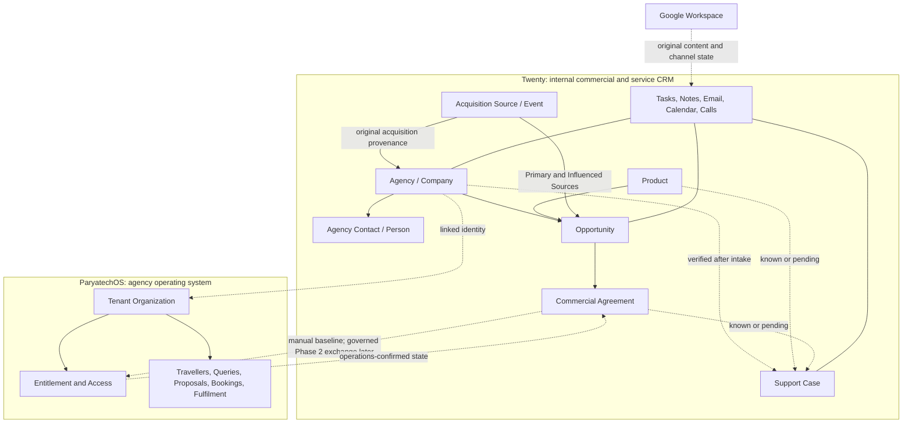
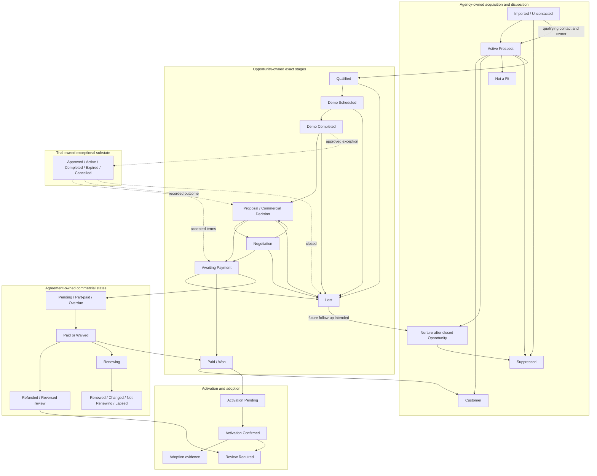
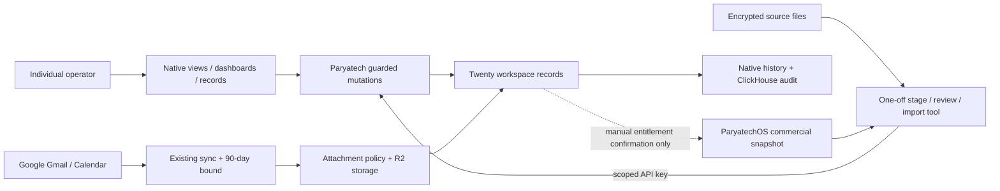
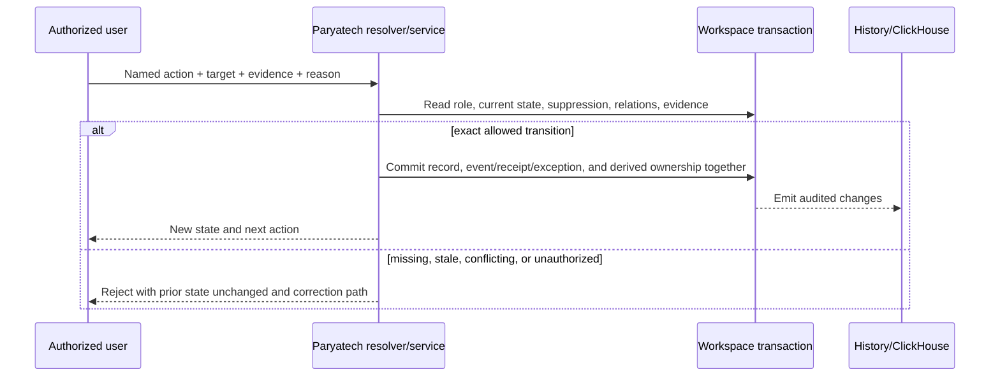
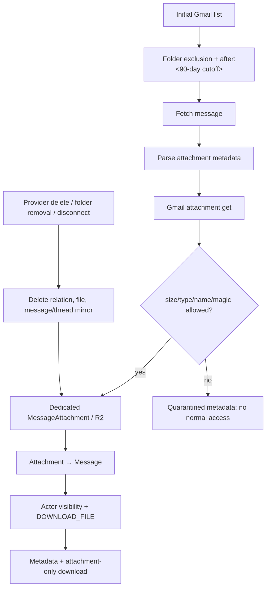

# Paryatech CRM Operations - Plan

## Goal Capsule

- **Objective:** Make Twenty Paryatech’s internal commercial and service operating spine for Indian B2C travel agencies, with enquiry-to-proposal as the first demo moment and 1,000 unique Agencies contacted within 90 days.
- **Product authority:** Twenty owns acquisition, sales, commercial, renewal, CRM communication associations, and support truth; Google and Belo own original channel content and delivery state; ParyatechOS owns tenant, travel operations, entitlement, provisioning, and access truth.
- **Operating approach:** Ship the contact-goal critical path independently with named non-state-changing reminders/alerts and only the R64/R99 reservation-expiry state change; prove disciplined workflows, then add separately gated mailbox, synchronization, and other evidence-led automation capabilities.
- **Execution profile:** Deep, cross-cutting delivery across native workspace configuration, manual operating procedures, bounded migration tooling, a narrow Paryatech control module, mailbox storage/sync, and production recovery/audit.
- **Stop conditions:** No live import before recovery/audit/role gates; no commercial authority switch with an unreconciled active ParyatechOS record; no mailbox rollout before the 90-day, attachment, scope, deletion, and recovery contract passes.
- **Tail ownership:** Two recovery administrators own platform continuity; named data, legal/compliance, commercial, support, audit, source-supply, and capacity owners retain their separately attributable gates through Day 90.

---

## Product Contract

Product Contract unchanged.

### Summary

Configure Twenty as Paryatech’s single internal CRM for agency acquisition, sales, agreements, renewals, communications, and support.
Use a staged operating spine that reaches useful daily operation before ParyatechOS synchronization, Belo integration, scoring, or any state-changing automation becomes a dependency; the sole launch exception is approved R64/R99 reservation expiry.

### Problem Frame

Paryatech’s agency relationships are fragmented across community spreadsheets, exhibitions, referrals, inbound enquiries, ads, email, phone, and WhatsApp.
The team cannot reliably answer which unique Agencies were attempted, reached, or engaged, who owns the relationship, where each pursuit stands, what was sold, which customers need support, or whether an event produced revenue.

The source data is not import-ready identity data.
The audited workbook alone has 259 data rows across 17 columns, repeated Company and Contact signals, 70 ambiguous Category values, and phones and postcodes stored numerically.
Direct import would create duplicates, erase provenance, and inflate outreach metrics, and that workbook alone cannot supply 1,000 reviewed unique Agencies.

ParyatechOS already owns agency-tenant and travel-operation workflows.
It also currently stores plans, subscriptions, trial and renewal dates, and payment state.
The approved target moves commercial terms, payment status, and renewal obligations to Twenty while leaving entitlement and provisioning in ParyatechOS, so rollout requires an existing-state reconciliation and cutover.

Support is already fragmented across channels at an expected 10–50 cases per week.
Tasks alone would not establish durable case identity, source-receipt timing, priority targets, waiting states, and resolution reporting.

### Key Decisions

- **Staged operating spine:** Launch with reviewed Agencies, suppression, reservation and ownership, Tasks, low-volume SMTP or manual logs, and contact counting; add mailbox and other integrations through independent gates.
- **Internal CRM boundary:** Twenty serves Paryatech’s 4–8 person operations team, not agency tenants or travellers; compatible Day-0 ownership roles may be combined without collapsing two-administrator recovery or restricted approval boundaries.
- **Contact metric:** The 1,000-Agency goal counts confirmed delivery or reached-channel evidence, not raw attempts, imports, provider acceptance alone, Pending / Unknown outcomes, failures, or bounces; attempts, channel completion, pending reconciliation, and two-way engagement remain separate diagnostics.
- **Agency ownership:** A visible time-bounded reservation prevents concurrent outreach, while durable ownership begins only at the first qualifying Contacted event.
- **Default sales path:** Every Agency that completes a demo proceeds to Proposal / Commercial Decision by default; pre-demo closure remains allowed, and an exceptional trial requires approval.
- **Exceptional trials:** A trial requires a recorded reason, owner, dates, success criteria, and outcome; there is no standard duration and no 14-day default.
- **Entity-owned lifecycles:** Agency disposition, Opportunity stage, Trial substate, Agreement payment and renewal, activation, and adoption are distinct state sets.
- **Commercial authority cutover:** Twenty becomes commercial authority only after every active ParyatechOS commercial record is reconciled across a bounded freeze or watermark/final-delta boundary; only inactive historical records may remain quarantined with provenance and recovery, and no undeclared record-level authority split is allowed. ParyatechOS retains entitlement and provisioning authority.
- **Commercial evidence and attribution:** Payment and renewal facts require approved evidence, verifier and freshness; Agency retains original acquisition provenance, while each Opportunity producing an Agreement owns one Primary Source and non-additive Influenced Sources, and its Agreement revenue counts once.
- **Shared service visibility:** Agencies, communications, and Support Cases launch broadly visible so sales, support, and operations can hand off work.
- **Canonical restricted commercial set:** Pricing, discounts, payment facts and references, Agreements, renewals, and private commercial notes are restricted; exports, destructive actions, settings, and administration are separately restricted.
- **Full-mailbox visibility consequence:** Every operator granted communications access can read full message bodies and any attachment content admitted to the CRM; commercial details inside those bodies are not hidden by commercial-field permissions.
- **Mailbox capability gap:** Twenty v2.27 supports Google connected accounts, full message bodies, and selective folder scope, but attachment documentation conflicts with metadata-only parsing and no native 90-day initial-history control was found.
- **Mailbox mirror semantics:** Native mailbox data is a synchronized mirror, not a proven independent archive; provider deletion, folder changes, and disconnection semantics must be validated against the approved retention policy.
- **Human outreach before campaigns:** Expected relevant business outreach is allowed with suppression controls and legal/compliance approval, but bulk blasting, sequences, and campaign execution are excluded.
- **Support Case at launch:** Every observable support receipt first attaches to a verified matching open Case or immediately creates a new owned Case at source-receipt time; unknown identity or commercial context remains pending, and later duplicate/non-support closure preserves receipt history and capture accounting.
- **Measured rollout:** Source sufficiency and operator capacity are Day-0 go/no-go inputs and weekly controls; commercial progress, operator adoption, demo policy, privacy, recovery, and data quality can falsify or pause scale-up.
- **Desktop-first launch:** Role-specific review surfaces use native Twenty views, filters, and dashboards first; launch targets Twenty’s currently supported desktop browser experience, preserves native keyboard and accessibility behavior, and adds custom UI only for a demonstrated blocker.

### Actors

- A1. **Agency Contact:** an external decision-maker or operator at an Indian B2C travel Agency.
- A2. **Operator:** a Paryatech sales, support, or operations user working shared and owned queues through an individual CRM account.
- A3. **Commercial-sensitive user:** a limited user who may see and edit pricing, discounts, payment facts and references, Agreements, renewals, and private commercial notes.
- A4. **Administrator and recovery owner:** one of two named people who manage access, settings, connections, retention controls, security halt, and recovery.
- A5. **Scoped integration identity:** a non-human actor limited to the allowlisted records and actions required for one connected system.
- A6. **Google Workspace and SMTP:** the authoritative provider for original mailbox/calendar content and available channel delivery state for `team@paryatech.in`.
- A7. **ParyatechOS:** the baseline entitlement/provisioning authority; automated synchronization is a Phase 2 actor only.
- A8. **Belo:** a Phase 2 actor for official shared-number message content and delivery state.
- A9. **Planner/data owner:** the person who reviews source supply, commercial progress, adoption evidence, privacy residual risk, and policy changes.

### Authority and entity model



Twenty owns the solid-line CRM records.
Provider content and ParyatechOS entitlement facts remain authoritative outside Twenty, and only approved associations or governed facts cross the dotted boundaries.

### Entity-owned lifecycles

| Owning record | State set | Transition rule |
|---|---|---|
| Agency acquisition | Imported / Uncontacted; Active Prospect; Customer | Import creates Uncontacted; the first qualifying Contacted event creates durable ownership and Active Prospect; Paid / Won can make the Agency a Customer. |
| Agency disposition | Eligible; Nurture; Not a Fit; Suppressed | Nurture is set only after an Opportunity closes Lost with future follow-up intended; it is never an Opportunity stage. Operators apply suppression immediately; only the legal/compliance owner may clear it from evidence and reason. |
| Temporary reservation | Claimed; Released; Expired | One visible claim prevents concurrent outreach before contact; release, expiry, recovery, and handoff do not create durable ownership. A Pending / Unknown channel outcome moves protection to an owned exception/cooldown rather than immediate reclaim. |
| Opportunity stage | Qualified; Demo Scheduled; Demo Completed; Proposal / Commercial Decision; Negotiation; Awaiting Payment; Paid / Won; Lost | This is the exhaustive stage set. Every transition follows the Opportunity transition evidence matrix. |
| Exceptional Trial substate | Approved; Active; Completed; Expired; Cancelled | Trial is an optional substate after Demo Completed, not an Opportunity stage; its outcome returns to Proposal, enters Awaiting Payment, or closes the Opportunity Lost. |
| Agreement payment | Pending; Part-paid; Paid; Overdue; Waived; Refunded; Reversed | Pending, Part-paid, and Overdue keep the Opportunity Awaiting Payment. Paid or an authorized Waived state permits Paid / Won; Refunded and Reversed preserve its historical outcome and trigger review. |
| Agreement renewal | Renewing; Renewed; Changed; Not Renewing; Lapsed | Renewal state is driven by Agreement term, evidence, owner, and next action; it never changes entitlement automatically. |
| Activation | Pending; Confirmed; Review Required | Operations confirms ParyatechOS access manually. Refunded, Reversed, or commercial conflict creates Review Required without rewriting historical Opportunity outcome. |
| Adoption | Not Assessed; Evidence Tracking; Milestone Recorded | Adoption is separate from payment and activation and changes only from observed usage or agreed success evidence. |
| Shared exception | New; Investigating; Blocked; Resolved; Reopened | Every exception names the affected capability and record, last trusted state, owner, due or escalation, and evidence; work resumes only through an explicit action after the applicable gate passes. |



### Contact metrics

| Metric | Qualifying evidence | Does not qualify |
|---|---|---|
| Attempted Agency | A personalized outbound action was initiated and recorded. | Import, reservation, Task creation, or an unsent draft. |
| Provider-accepted / completed-call attempt | The provider accepted a message for processing or an operator completed a call attempt without a local/system failure. | Local send failure, abandoned dial, or missing channel evidence. |
| Pending / Unknown communication | An initiated attempt lacks confirmed delivery, failure, or reached-channel evidence inside the normal channel observation period and enters owned reconciliation. | It never qualifies as Contacted unless approved evidence later establishes a qualifying outcome. |
| Contacted Agency | A message has provider-confirmed delivery or approved reconciled delivery evidence, a call reaches a person, or an inbound enquiry/conversation is received. | Provider acceptance alone, Pending / Unknown, bounce, failed delivery, unanswered/failed call, import, or repeated touch. |
| Engaged Agency | A reply, two-way conversation, or substantive live interaction is recorded. | Delivery without response, provider acceptance, voicemail, or one-way outreach. |

The headline 1,000 target uses unique Contacted Agencies.
Attempted, provider-accepted/completed-call, Pending / Unknown, Contacted, Engaged, and downstream funnel metrics must remain visible together so delivery or market-response failure cannot be hidden by volume.

### Commercial evidence and payment transitions

Every manual commercial fact records the approved evidence source and type, verifier, observed-at time, recorded-at time, and reconciliation state of Current, Stale, or Conflict.
The commercial owner reviews evidence on an approved cadence and before entitlement-changing action.

| Agreement payment state | Opportunity effect | Activation or entitlement effect |
|---|---|---|
| Pending | Remains Awaiting Payment. | None. |
| Part-paid | Remains Awaiting Payment. | None unless a separately approved commercial policy and manual entitlement decision allow it. |
| Overdue | Remains Awaiting Payment and enters owned follow-up. | Existing access is reviewed manually; no automatic removal. |
| Paid | May move to Paid / Won when evidence is verified. | Operations may provision or verify access, then confirm activation manually. |
| Waived | May move to Paid / Won only with authorized waiver evidence and reason. | Operations may provision or verify access, then confirm activation manually. |
| Refunded | Preserves the historical Paid / Won outcome and reports the refunded amount separately from gross booked and net collected. | Creates a commercial and entitlement Review Required state; it does not silently change access. |
| Reversed | Preserves the historical Paid / Won outcome and reports the reversed amount separately from gross booked and net collected. | Creates a commercial and entitlement Review Required state; it does not silently change access. |

Commercial measures are canonical: gross booked is the agreed amount before waiver, refund, or reversal; waived is the authorized amount never due for collection; Refunded/Reversed is verified collected value later returned or reversed; net collected is verified cash collected minus Refunded/Reversed.
A fully waived Agreement therefore has zero net collected, and ROI or spend decisions use net collected while gross and historical outcomes remain visible.

### Opportunity transition evidence matrix

The stage values remain product concepts rather than interface actions.
Every allowed advance, return, closure, or correction uses this matrix.

| Allowed transition | Minimum qualifying evidence | Authorized actor | Blocked outcome | Correction or reopen path |
|---|---|---|---|---|
| Qualified → Demo Scheduled | Confirmed Agency fit and need, participating Contact, demo date, owner, and next action | Opportunity owner | Remain Qualified | Add missing evidence or correct the planned date before retry |
| Demo Scheduled → Demo Completed | Occurred-at time, attendees, demonstrated Product or bundle, need/outcome notes, and dated next action | Opportunity owner or assigned demonstrator | Remain Demo Scheduled | Record reschedule/no-show and new next action, or close Lost with evidence |
| Demo Completed → Proposal / Commercial Decision | Demo outcome, Product or bundle, decision participants, commercial next action, and date | Opportunity owner | Remain Demo Completed | Add or correct the demo outcome and decision evidence |
| Demo Completed → Trial | Authorized exception approval plus reason, Product scope, owner, dates, success criteria, and expected decision | Opportunity owner and authorized trial approver | Remain Demo Completed | Complete or correct trial controls before activation |
| Trial → Proposal / Commercial Decision | Recorded trial outcome and continuing commercial decision | Opportunity owner | Trial remains unresolved | Add or correct outcome evidence |
| Trial → Awaiting Payment | Recorded trial outcome, accepted commercial terms, Agreement, and Pending, Part-paid, or Overdue evidence | Opportunity owner and commercial-sensitive user | Trial remains unresolved | Correct Agreement or payment evidence |
| Trial → Lost | Recorded trial outcome, loss reason, decision date, and revisit date when relevant | Opportunity owner | Trial remains unresolved | Correct closure evidence; a later new pursuit uses a new Opportunity |
| Proposal / Commercial Decision → Negotiation | Delivered proposal or recorded commercial decision context, open term or price issue, owner, and next action | Opportunity owner | Remain Proposal / Commercial Decision | Add proposal or negotiation evidence |
| Negotiation → Proposal / Commercial Decision | Negotiation outcome returns to an updated proposal or decision, with owner and next action | Opportunity owner | Remain Negotiation | Record the updated proposal or decision context |
| Proposal / Commercial Decision or Negotiation → Awaiting Payment | Accepted terms, Agreement, payment obligation, owner, and due next action | Opportunity owner and commercial-sensitive user | Remain in the prior stage | Correct Agreement, acceptance, or payment obligation evidence |
| Qualified, Demo Scheduled, Demo Completed, Proposal / Commercial Decision, Negotiation, or Awaiting Payment → Lost | Loss reason, decision date, evidence, and revisit date when relevant | Opportunity owner | Remain in the current stage | Correct closure evidence; an erroneous closure may reopen to the prior evidenced stage with reason and audit, while a materially new pursuit uses a new Opportunity |
| Awaiting Payment → Paid / Won | Agreement with verified Paid evidence or authorized Waived evidence, verifier, freshness, and activation next action | Commercial-sensitive user | Remain Awaiting Payment | Correct or reconcile evidence; Refunded or Reversed later preserves the historical win and creates review |

### Requirements

**System boundary and records**

- R1. Twenty must remain one internal Paryatech workspace for agency acquisition, sales, agreements, renewals, CRM communication associations, and support.
- R2. Company must represent one canonical Agency with identity, geography, specialization/cohort, team-size band, affiliations, current tools, lifecycle, ICP evidence, original acquisition provenance, owner, suppression, and optional ParyatechOS organization reference.
- R3. Person must represent an Agency Contact with designation, contact methods, relevant profile link, buying or operating role, preferred channel, status, suppression, and Company relationship.
- R4. Opportunity must represent one commercial pursuit with Agency, Contacts, owner, Product or bundle interest, exact stage, value, demo and proposal facts, next action, outcome, reason, one Primary Source, and non-additive Influenced Sources when it produces an Agreement.
- R5. Custom Acquisition Source/Event, Product, Commercial Agreement, and Support Case records must hold the approved business facts without duplicating ParyatechOS travel operations.
- R6. Native Tasks, Notes, email, calendar, calls, and meetings must provide accountable next actions and interaction history around the relevant CRM record.
- R7. Product must describe active offerings, reference price, eligible bundle groupings, and approved terms, including quarterly, half-yearly, or yearly ParyatechOS and yearly itinerary-builder terms.
- R8. Controlled business vocabularies must govern lifecycle, specialization/cohort, affiliation, current tools, team size, loss reason, payment, renewal, and support priority values.

**Acquisition, identity, and import**

- R9. Acquisition Source/Event must retain type, source name, event context, cost, booth/team, outreach basis, source batch, and relations that preserve Agency acquisition provenance and support Opportunity-grain funnel, Agreement revenue, and ROI reporting.
- R10. Imported or untouched Agencies must remain shared and Uncontacted without an owner or Opportunity created by import alone.
- R11. Outreach must record channel, times, outcome, delivery evidence, next action, and reservation or owner without collapsing Attempted, provider-accepted/completed-call, Pending / Unknown, Contacted, and Engaged events.
- R12. The headline metric must count the first qualifying Contacted event once and exclude imports, duplicate Companies, repeated Contacts, repeated touches, Pending / Unknown outcomes, failed or bounced attempts, unresolved candidates, and suppressed records.
- R13. Operators must apply Agency- or Contact-level suppression immediately and may request clearance, but only the named legal/compliance owner may approve clearance from retained evidence and a recorded reason; outbound remains blocked until approval, while minimum history and identity-matching evidence are preserved.
- R14. Every source file must enter restricted staging as text with untouched values, source position, batch identity, and cleaning outcome; raw bulk import is prohibited.
- R15. Normalization must preserve original names and ambiguous values while safely standardizing whitespace, email case, website hosts, geography, phones, and postcodes.
- R16. Repeated Company, email, phone, and website signals must create match candidates for human review rather than automatic merges.
- R17. Reviewers must resolve Companies before People, quarantine unresolved or unsafe rows, and import only approved Sources, Companies, People, relations, and evidenced facts in that order.
- R18. Category values must remain source provenance until a reviewed mapping promotes them into specialization or cohort values.
- R19. Every imported live record must remain traceable to source label, sheet, row ordinal, batch, review decision, and import time without duplicating raw PII into visible fields.

**Sales, trials, commercial state, and renewal**

- R20. The exhaustive Opportunity stages must be Qualified, Demo Scheduled, Demo Completed, Proposal / Commercial Decision, Negotiation, Awaiting Payment, Paid / Won, and Lost.
- R21. Every Opportunity advance, return, closure, correction, or reopen must follow the transition evidence matrix, require its authorized actor and qualifying evidence, and otherwise leave the last trusted stage unchanged with an owned correction path.
- R22. Lost must record reason, decision date, and revisit date when relevant; an erroneous closure may reopen to the prior evidenced stage with reason and audit, while a materially new pursuit must use a new Opportunity.
- R23. Exceptional Trial must be available only after Demo Completed and must never be selected from Agency size.
- R24. A trial must record business reason, accountable owner, Product scope, start, end, success criteria, expected decision, activation state, extension reason when extended, and final outcome.
- R25. Trial completion must return the Opportunity to Proposal / Commercial Decision or Awaiting Payment, or close it Lost and set Agency disposition to Nurture only when future follow-up is intended.
- R26. Commercial Agreement must record Agency, source Opportunity, Products or bundle, term, dates, price, currency, commercial exception, payment facts, renewal obligation, and restricted notes.
- R27. Payment state must be Pending, Part-paid, Paid, Overdue, Waived, Refunded, or Reversed and must change only from verified approved evidence.
- R28. Opportunity may become Paid / Won only when Agreement payment is Paid or authorized Waived; Pending, Part-paid, and Overdue remain Awaiting Payment.
- R29. Operations must provision or verify ParyatechOS access and manually record activation status, date, and confirmer in Twenty.
- R30. Adoption must remain a separate evidence-based milestone that is not inferred from payment, activation, trial activity, or time elapsed.
- R31. Renewal must use Agreement term and renewal date, an accountable owner, dated next action, current evidence, and an outcome of Renewing, Renewed, Changed, Not Renewing, or Lapsed.

**Support and communications**

- R32. On every observable support receipt, intake must first attach the receipt to a verified matching open Case when one exists; otherwise it must create a new owned Case immediately at source-receipt time with subject, summary, channel, priority, response target, status, escalation, communications, and resolution, even when Agency, Contact, Product, and Agreement are unknown.
- R33. Support Case statuses must be New, Assigned, In Progress, Waiting on Agency, Waiting Internal, Resolved, and Closed; ambiguous identity must remain pending and unassociated until reviewed, reopening must return the same Case to In Progress, and later duplicate or non-support determinations must close the created Case with explicit disposition while preserving receipt time and history.
- R34. Internal first-response targets must be Urgent within 1 business hour, High within 4 business hours, Normal within 1 business day, and Low within 2 business days.
- R35. The response clock must start at observable source-channel receipt, and only a substantive human response may satisfy it; assignment and automatic acknowledgement must not.
- R36. `team@paryatech.in` must operate as both an OAuth-connected human Google Workspace account and a low-volume SMTP transactional sender.
- R37. The connected account target must provide full message bodies, required attachment access, a bounded 90-day initial history, and ongoing synchronization for in-scope customer-facing mailbox and calendar sources.
- R38. Drafts, Spam, Trash, designated private/internal mail, private calendars, and all-internal threads or events must be excluded from automatic CRM association.
- R39. Every operator with communication access must be able to read full message bodies and any admitted attachment or event content, so content unsuitable for team-wide visibility must remain outside synchronized scope.
- R40. Transactional SMTP messages must relate to a specific CRM event or record and must not become campaign, sequence, or bulk-send behavior.
- R41. The official shared business number must be the preferred WhatsApp channel; personal-number exceptions must be logged manually with source time, participants, evidence, outcome, next action, and owner.
- R42. Belo adapter behavior must remain Phase 2 until official-number workflow, personal exceptions, suppression, matching, failure review, and ownership are stable.

**Permissions, privacy, and audit**

- R43. Two named administrators must retain protected recovery access and manage users, roles, settings, connections, retention controls, and recovery without using administration as their default operating role.
- R44. Operators must see and update shared Agency, Contact, Opportunity, Task, activity, communication, and Support Case facts while lacking commercial-sensitive, broad-export, destructive, settings, and integration powers.
- R45. Only commercial-sensitive users must see or edit pricing, discounts, payment facts and references, Agreements, renewals, and private commercial notes.
- R46. Each scoped integration identity must have only its required records and actions, with no interactive administration, broad export, user management, or settings access.
- R47. Bulk exports, permanent destruction, role changes, workflow/object changes, retention changes, and integration settings must be separately authorized and audited.
- R48. Mailbox data must be treated as a synchronized mirror whose provider deletion, folder-change, disconnection, retention, deletion, and recovery behavior is validated before rollout; independent archival retention is required only if approved policy demands it and then separately gates mailbox rollout.
- R49. Business-record auditability must combine native record history with mandatory reason and evidence fields for ownership, lifecycle, suppression, trial, commercial, activation, adoption, renewal, and Support Case changes.

**Authority, integration, reporting, and rollout**

- R50. Twenty must remain authoritative for CRM identity, ownership, sales, Support Cases, suppression, and CRM relationships, and becomes the single global authority for Agreements, payment status, and renewals only after every active commercial record passes reconciliation and the declared cutover boundary.
- R51. ParyatechOS must remain authoritative for linked tenant identity, approval, entitlement, provisioning, and access; Google and Phase 2 Belo remain authoritative for original channel content and available delivery state.
- R52. Phase 2 authority conflicts must preserve both source facts, stop dependent state changes, and enter the shared exception lifecycle; latest-write-wins behavior is prohibited.
- R53. Initial contact-goal operation must be independently shippable with reviewed Agencies, suppression, reservation and ownership, Tasks, low-volume SMTP or manual communication logs, and distinct contact counting.
- R54. Governed ParyatechOS synchronization and Belo adapter work must enter Phase 2 only after matching, authority, suppression, trust, reconciliation, and failure gates pass.
- R55. Except only for approved reservation expiry under R64 and R99, scoring and all other state-changing automation are prohibited at launch and may enter only from measured evidence; none may bypass suppression, human qualification, trial approval, commercial permissions, or manual activation.
- R56. Dashboards must separate outreach metrics and cover source supply, capacity forecast, funnel, demo performance, workload, support capture and targets, commercial evidence and renewals, activation/adoption, gross booked, waived, refunded/reversed, net collected, and Opportunity-grain primary/influenced source ROI.
- R57. Day 0 must prove roles, privacy, suppression, SMTP delivery evidence, backup and file recovery, restore rehearsal, monitoring ownership, a reconcilable staged pilot, source-sufficiency and operator-capacity go/no-go decisions, the commercial-target rule, and verification or remediation of the backup secret owner and mode to root `0600`.
- R58. Mailbox rollout must separately validate full-body and folder scope, attachment access, bounded 90-day initial history, calendar scope, association safety, provider deletion/disconnection semantics, restricted visibility, and recovery without blocking manual outreach.
- R59. The first 30 days must reach 333 unique Contacted Agencies, maintain approved source replenishment and operator capacity, capture adoption and demo baselines, and lock the Day-90 commercial-progress target produced by the Day-0-approved formula and evidentiary floor.
- R60. Day 90 must reach 1,000 unique Contacted Agencies, report pass or fail against the locked commercial target separately from narrative variance, trigger a named product decision on failure, and make delivery, engagement, funnel, workload, support, commercial measures, and Opportunity-grain ROI reportable.
- R61. Failed imports, mailbox or SMTP operations, Pending / Unknown communications, integration conflicts, and baseline automations must preserve the last trusted state, enter the shared exception lifecycle, prevent duplicate external action, and require explicit evidence-based resume.
- R62. Only the affected capability must pause when its gate fails; recovery or monitoring failure, restricted-data exposure, or unreconstructable records must pause the broader sensitive-data rollout.

**Source supply and contact integrity**

- R63. Attempted, provider-accepted/completed-call, Pending / Unknown, Contacted, and Engaged Agency metrics must use the definitions in this contract and retain channel evidence for reconciliation.
- R64. A pre-contact reservation must allow one visible claimant per Agency, prevent collision, expire or release after an approved interval, support audited transfer, and create no durable owner before qualifying contact; Pending / Unknown moves protection to an owned exception/cooldown rather than immediate reclaim.
- R65. Identity review must offer the outcomes Confirm Existing Agency, Create New Agency, Reject Match, Keep Separate Contacts, or Quarantine with Reason using side-by-side source and candidate provenance, and an approved decision may reopen before import.
- R66. A named source-supply owner must maintain quantified reviewed-to-contactable yield, reviewed unsuppressed unique-Agency inventory, and dated replenishment sources sufficient for the Day 30 and Day 90 targets under observed duplicate, suppression, and delivery rates.
- R67. Source sufficiency is a Day-0 go/no-go and weekly checkpoint: if yield and dated replenishment cannot support 333 and 1,000 Contacted Agencies, the named owner must choose approved source acquisition, target or timeline revision, or stopped scale-up without relaxing identity, suppression, or legal gates.
- R68. Inbound enquiries must resolve or review Agency and Contact identity, record source and receipt time, assign an owner, create the commercial pursuit, and follow the same qualification, demo, and proposal controls as outbound work.

**Commercial evidence, cutover, and attribution**

- R69. Each payment, waiver, refund, reversal, and renewal change must record approved evidence source/type, verifier, observed-at time, recorded-at time, reconciliation cadence, and Current, Stale, or Conflict state.
- R70. Refunded or Reversed after Paid / Won must preserve the historical win and evidence, report the affected amount separately, and create an owned commercial and entitlement review without automatically changing access.
- R71. Existing ParyatechOS commercial facts must be mapped and reconciled through either a bounded mutation freeze or a snapshot watermark plus final delta; every active commercial record must reconcile before the global switch, while only inactive historical records may remain quarantined with provenance and recovery.
- R72. Cutover must declare snapshot or freeze time, changes during review, final pre-switch comparison, post-switch write boundary, source identifiers, values, timestamps, mappings, verifier, conflict disposition, cutover time, and rollback handling; no undeclared record-level authority split is permitted.
- R73. Each Opportunity that produces an Agreement must have one auditable Primary Source and non-additive Influenced Sources; its Agreement revenue rolls through that pursuit and counts once, Agency retains original acquisition provenance, source costs remain with their source, and ROI or spend decisions use net collected while gross booked, waived, Refunded, Reversed, and historical wins remain visible.

**Support completeness, adoption, and operating priority**

- R74. All observable support requests are the response-performance and capture denominator from source receipt; each must attach to a verified matching open Case or create a new owned Case immediately, and missing, late, duplicate, or non-support dispositions must remain in accounting rather than disappear from reporting.
- R75. Manual phone and personal-WhatsApp support must be sampled on an approved cadence against available source evidence, with omissions and capture latency owned and reported.
- R76. Pilot gates must measure sampled off-CRM omissions, capture latency, duplicate outreach, required-workflow adherence, and observed operator time per Agency or Case against thresholds approved before scale-up.
- R77. Day 0 must inventory and name parallel prospecting, support, commercial, and renewal trackers, and each rollout gate must retire the tracker whose purpose Twenty has proven it can own.
- R78. The Day 30 review must measure qualified-to-demo wait, no-show rate, operator time, demo completion, and demo-to-proposal and win conversion by cohort and may retain or separately reconsider the demo-first policy from evidence.
- R79. Operator daily priority must be urgent or overdue support and security/integration exceptions, then due renewals and activation, then overdue owned sales actions, then shared-pool prospecting.
- R80. Role-specific source-supply, identity-quarantine, commercial-staleness, audit/security-exception, integration-health, adoption, and policy-evidence review surfaces must be composed from native Twenty views, filters, and dashboards first; custom UI is allowed only for a demonstrated blocker.
- R81. Mailbox attachment or history gaps must pause only mailbox-dependent association, history, attachment, or calendar features, while reviewed-Agency outreach continues through the independent contact-goal critical path.
- R82. The 90-day baseline must not include ParyatechOS or Belo adapter delivery; only their authority boundaries, manual ParyatechOS activation, and Phase 2 entry gates are required.

**Security, compliance, audit infrastructure, and device scope**

- R83. Every human must use an individual CRM account; shared CRM logins are prohibited, strong MFA is required for administrators and commercial-sensitive users, recovery access is separately protected and audited, and access is revoked promptly after role or employment change.
- R84. Google grants and SMTP credentials must use minimum approved capability, remain absent from normal UI, logs, audit payloads, and exports, and support administrator-only connection, revocation, rotation, and emergency halt pending owned security review.
- R85. Calendar synchronization must admit only approved customer-facing calendars and event fields, exclude private and all-internal events, and include descriptions or attachments only when suitable for broad operator visibility.
- R86. Imports and synchronized attachments must be treated as hostile: formulas and active content remain inert, accepted type and size are bounded, and malformed or suspicious content is quarantined from normal operator handling.
- R87. Agency and Contact PII must be minimized and governed across source files, staging, live records, Notes, mail, attachments, exports, audit records, logs, and backups with purpose-bound access, retention, deletion propagation, and narrowly retained suppression evidence.
- R88. CRM content must exclude payment-instrument data, bank or UPI credentials, authentication secrets, and unnecessary identity documents or identifiers from fields, Notes, mail, and attachments.
- R89. Mail association must use verified unambiguous identity signals; ambiguous or suspicious mail enters owned review without broad association and cannot mutate identity, commercial, suppression, or entitlement state.
- R90. Phase 2 ParyatechOS exchange must require authenticated origin, integrity, freshness and replay controls, an allowlisted minimum fact set, and owned reconciliation for data outside authority or contract.
- R91. A named legal/compliance owner must approve the outreach basis, notices, suppression process, and retained evidence before scaled outreach without the CRM asserting a legal conclusion.
- R92. Privileged and business audit evidence must exist before high-risk capabilities or restricted-data broad rollout through ClickHouse plus valid entitlement or a bounded equivalent; it must be tamper-evident, unmodifiable or undeletable by monitored identities, restricted to approved readers, classification-preserving, secret-free, and retained for investigation.
- R93. The named data owner must accept the residual risk that admitted shared-mailbox bodies can expose commercial or other sensitive details broadly despite field-level restrictions.
- R94. Launch must support the current desktop browser experience and preserve native Twenty keyboard navigation, focus behavior, semantics, and accessibility; custom mobile UI is excluded unless planning identifies a launch blocker.

**Round 2 operating controls**

- R95. At Day 0 and weekly, a named capacity owner must forecast the weekly pace required for 333 and 1,000 Contacted Agencies from observed time per Agency and Support Case and available operator time after higher-priority work; a shortfall requires immediate adjustment to staffing, rotations, or rollout scope.
- R96. The Opportunity transition evidence matrix is canonical for every allowed advance, return, closure, correction, and reopen; no other transition is permitted without an approved product-contract change.
- R97. Support intake must first attach an observable receipt to a verified matching open Case; if none exists, it must create a new owned Case immediately at source-receipt time even with unknown Agency, Contact, Product, or Agreement. Ambiguous identity remains pending and unassociated until reviewed, and a later duplicate or non-support determination closes that Case with explicit disposition while preserving receipt time, history, and capture accounting.
- R98. Shared exceptions must use New, Investigating, Blocked, Resolved, and Reopened, expose affected capability and record plus last trusted state, owner, due or escalation and evidence, and require an explicit resume only after the failed gate passes.
- R99. Baseline automation is limited to named non-state-changing reminders and alerts; approved expiry from Claimed to Expired under R64 is the only launch state-changing automation exception. There is no generic automation framework, and no automation may infer or mutate identity, suppression clearance, qualification, Opportunity stage, commercial, activation, adoption, renewal, or Case resolution state.
- R100. Pending / Unknown communication must enter owned reconciliation for a planning-defined maximum window, never count as Contacted, prevent blind duplicate attempts through exception/cooldown protection, reconcile late delivery, and after expiry permit only a reasoned visible retry approved under the operating policy.
- R101. Day 0 must approve the commercial-target formula, minimum evidentiary floor, accountable owner, and Day-30 lock date; Day 90 reports pass or fail against the locked target separately from narrative and routes failure to a named product decision.
- R102. Sensitive CRM, mailbox, calendar, commercial, and PII data must use authenticated encrypted transport and remain encrypted in database, object/file/attachment storage, exports at rest, and backups, with key access limited to authorized recovery or platform identities.
- R103. Compatible Day-0 ownership roles may be combined within the 4–8 person team, but two-administrator recovery, legal/compliance suppression clearance, commercial-sensitive approval, audit review, and other restricted approval boundaries must remain separately accountable.

### Key Flows

- F1. Reviewed source import and identity adjudication
  - **Trigger:** A new community, exhibition, referral, inbound, or ad dataset is approved for CRM use.
  - **Actors:** A2, A4, A9
  - **Steps:** Stage values as text; normalize without discarding raw evidence; compare candidates side by side; choose Confirm Existing, Create New, Reject Match, Keep Separate Contacts, or Quarantine with Reason; reopen an approved choice before import when evidence changes; import approved Sources, Agencies, Contacts, and relations.
  - **Outcome:** Shared Uncontacted Agencies enter Twenty with provenance and without false ownership, Opportunities, or contact counts.
  - **Covered by:** R9–R19, R65–R67, R86–R87

- F2. Reserved outbound prospecting
  - **Trigger:** An operator selects an eligible Agency from the shared pool.
  - **Actors:** A1, A2
  - **Steps:** Check suppression and identity; claim a time-bounded reservation; prevent competing claims; record the attempt and channel outcome; release or expire proven failed claims; move Pending / Unknown protection to an owned exception/cooldown with no blind duplicate attempt; create durable ownership only on qualifying Contacted evidence; proceed through qualification and the transition evidence matrix.
  - **Outcome:** Duplicate outreach is prevented, all contact outcomes remain distinct, and one owner becomes accountable only after confirmed contact.
  - **Covered by:** R10–R13, R20–R22, R63–R64, R79, R96, R100

- F3. Exceptional trial
  - **Trigger:** Demo evidence supports a special-case trial.
  - **Actors:** A1, A2, A3, A7
  - **Steps:** Record reason, owner, Product scope, dates, success criteria, and expected decision; operations confirms any ParyatechOS activation; track evidence; record outcome or reasoned extension.
  - **Outcome:** The Opportunity returns to Proposal, Awaiting Payment, or closes Lost; only the Agency may then enter Nurture.
  - **Covered by:** R23–R25, R29–R30

- F4. Agreement, evidence, activation, and renewal
  - **Trigger:** Commercial terms are accepted.
  - **Actors:** A2, A3, A7
  - **Steps:** Complete the Agreement; verify evidence and freshness; keep Pending, Part-paid, or Overdue in Awaiting Payment; permit Paid / Won only from verified Paid or authorized Waived; provision access in ParyatechOS; confirm activation manually; track adoption; report gross booked, waived, Refunded/Reversed, and net collected; manage renewal and any commercial review.
  - **Outcome:** Commercial, entitlement, activation, adoption, payment adjustment, revenue-measure, and renewal facts remain distinct, evidenced, and owned.
  - **Covered by:** R26–R31, R69–R73

- F5. Support capture and response
  - **Trigger:** An observable issue arrives by email, phone, WhatsApp, or manual report.
  - **Actors:** A1, A2
  - **Steps:** First attach the receipt to a verified matching open Case; if none exists, immediately create a new owned Case at source-receipt time even when Agency, Contact, Product, or Agreement are unknown; keep ambiguous identity pending and unassociated until review; assign priority and respond within target; if later found duplicate or non-support, close the created Case with explicit disposition while preserving receipt time and history; otherwise resolve, close, or reopen the same history.
  - **Outcome:** Every observable receipt remains in capture and response accounting without false association, delayed Case creation, or disappearing duplicate/non-support work.
  - **Covered by:** R32–R35, R41, R74–R75, R97

- F6. Separately gated shared mailbox
  - **Trigger:** `team@paryatech.in` receives, sends, or schedules an in-scope customer interaction.
  - **Actors:** A1, A2, A4, A6, A9
  - **Steps:** Validate approved mail and calendar scope, full bodies, identity association, attachment behavior, the 90-day boundary, provider deletion/disconnection semantics, broad visibility, and retention; relate only verified unambiguous content; send only record-specific low-volume transactional mail.
  - **Outcome:** The mailbox activates only after its own gate, while manual and SMTP-backed outreach remains independently available.
  - **Covered by:** R36–R40, R48, R58, R81, R84–R85, R89, R93

- F7. Baseline exception and manual recovery
  - **Trigger:** An import, communication outcome, mailbox, SMTP, audit, security, integration, or named baseline automation is stale, mismatched, incomplete, or outside its authority.
  - **Actors:** A2, A4, A5, A9
  - **Steps:** Preserve the affected capability and record plus last trusted state; create a New exception; assign owner, due and escalation; move through Investigating or Blocked; preserve evidence and prevent dependent changes or duplicate sends; mark Resolved only after reconciliation evidence passes the gate; resume explicitly; move to Reopened if the condition recurs.
  - **Outcome:** No silent overwrite, false contact, privacy leak, lost support issue, blind retry, or hidden failure enters operational reporting.
  - **Covered by:** R46–R49, R52, R57–R62, R76, R83–R90, R92, R98–R100, R102

- F8. Inbound enquiry to proposal
  - **Trigger:** An Agency Contact submits or communicates an inbound product enquiry.
  - **Actors:** A1, A2
  - **Steps:** Record source and receipt time; resolve or review Agency and Contact identity; record Contacted and Engaged evidence; assign an owner; create and qualify the Opportunity; schedule and complete the demo; record exit evidence; move to Proposal / Commercial Decision.
  - **Outcome:** The first demo moment works for inbound demand without bypassing identity, ownership, suppression, or stage controls.
  - **Covered by:** R2–R4, R11–R12, R20–R21, R63, R68, R96

- F9. Existing commercial-state cutover
  - **Trigger:** Paryatech approves the mapping from current ParyatechOS commercial facts to the target Agreement model.
  - **Actors:** A3, A4, A7, A9
  - **Steps:** Inventory every active and inactive plan, subscription, trial/renewal, and payment fact; choose a bounded mutation freeze or snapshot watermark; preserve source IDs, values, times, and evidence; reconcile every active record and quarantine only inactive historical conflicts with provenance and recovery; process the final delta; compare immediately before switch; declare the post-switch write boundary; retain rollback for mutations found after cutover.
  - **Outcome:** Twenty becomes the single global commercial authority only after every active record and final delta reconcile, with no undeclared record-level split, while ParyatechOS continues to own entitlement and provisioning.
  - **Covered by:** R50–R51, R69, R71–R73

- F10. Phase 2 governed synchronization
  - **Trigger:** A later ParyatechOS or Belo integration passes every Phase 2 entry gate.
  - **Actors:** A4, A5, A7, A8, A9
  - **Steps:** Authenticate the source; verify origin, integrity, freshness, and replay status; accept only allowlisted authoritative facts; preserve both sides on conflict; create owned reconciliation without changing trusted state.
  - **Outcome:** Deferred channel and entitlement exchange cannot expand authority or become a hidden launch dependency.
  - **Covered by:** R42, R51–R54, R82, R90

- F11. Role-specific daily operating order
  - **Trigger:** A team member begins or replans daily work.
  - **Actors:** A2, A3, A4, A9
  - **Steps:** Operators handle urgent/overdue support and security/integration exceptions first, due renewal and activation work second, overdue owned sales actions third, and shared-pool prospecting fourth; planners and administrators use native review surfaces for supply, capacity, quarantine, staleness, security/audit, integration, adoption, and policy evidence.
  - **Outcome:** Risk and customer obligations outrank volume while capacity shortfall remains visible and owned.
  - **Covered by:** R56, R66–R80, R92, R95, R103


- F12. Day-0 and weekly capacity forecast
  - **Trigger:** Day 0 begins or the weekly operating review opens.
  - **Actors:** A2, A4, A9
  - **Steps:** Measure time per Agency and Support Case; subtract higher-priority workload from available operator time; compare forecast weekly Contacted throughput with the pace required for 333 and 1,000; combine compatible ownership roles only within protected approval boundaries; choose staffing, rotation, or rollout-scope correction when short.
  - **Outcome:** The contact target has a staffed capacity path or an explicit owned rollout correction rather than hidden overload.
  - **Covered by:** R57, R60, R76, R79–R80, R95, R103

### Acceptance Examples

- AE1. Identity review has explicit outcomes
  - **Covers R14–R19, R65.**
  - **Given:** Two staged rows share a normalized business name and phone but show different Contacts and source values.
  - **When:** A reviewer compares source and candidate records side by side.
  - **Then:** The reviewer can confirm an existing Agency, create a new Agency, reject the match, keep Contacts separate, or quarantine with reason, and may reopen the decision before import.

- AE2. Import does not manufacture outreach
  - **Covers R10–R12, R17, R67.**
  - **Given:** A reviewed Agency and Contact are imported from a community list.
  - **When:** No qualifying channel evidence exists.
  - **Then:** The Agency remains shared and Uncontacted, has no durable owner or Opportunity, and contributes zero to every contact metric.

- AE3. First qualifying contact establishes accountability once
  - **Covers R11–R12, R63–R64.**
  - **Given:** An operator holds the only active reservation for an eligible Agency.
  - **When:** A message gains qualifying delivery evidence or a call reaches a person.
  - **Then:** The operator becomes durable owner and the Agency increments Contacted once, while later touches do not inflate the count.

- AE4. Suppression must be cleared before outbound
  - **Covers R13, R40–R41, R47, R49, R103.**
  - **Given:** Either the Agency or selected Contact is suppressed.
  - **When:** An operator or integration attempts CRM-assisted outbound or an operator requests clearance.
  - **Then:** Outbound is blocked; suppression applies immediately, and only the named legal/compliance owner may clear it from retained evidence and a recorded reason before a visible retry.

- AE5. Trial cannot become the default path
  - **Covers R20, R23–R25.**
  - **Given:** A demo is complete but trial reason, dates, owner, or success criteria are missing.
  - **When:** The Opportunity is advanced.
  - **Then:** Exceptional Trial is unavailable and the default path remains Proposal / Commercial Decision or Lost.

- AE6. Payment does not activate access
  - **Covers R26–R30, R69.**
  - **Given:** An Agreement has verified Paid evidence and the Opportunity is Paid / Won.
  - **When:** ParyatechOS access has not been provisioned and confirmed by operations.
  - **Then:** Activation remains Pending and adoption remains Not Assessed.

- AE7. Support priority uses source time and human response
  - **Covers R32–R35, R74–R75.**
  - **Given:** A High-priority issue arrives during approved business hours and its Case is created late.
  - **When:** The system acknowledges it but no operator responds within 4 business hours of source receipt.
  - **Then:** The Case breaches its target, the late capture counts as a failure, and both remain visibly owned.

- AE8. Mailbox rollout proves bounded mirror behavior
  - **Covers R37–R39, R48, R58, R81.**
  - **Given:** Google OAuth, folder scope, and broad communications visibility are configured.
  - **When:** the mailbox gate is evaluated against Twenty v2.27 and provider deletion or disconnection.
  - **Then:** Full bodies and exclusions must work, attachment and 90-day behavior must be validated or provided, retention semantics must match policy, and failure pauses mailbox-dependent features rather than manual outreach.

- AE9. Commercial restrictions survive broad collaboration
  - **Covers R43–R49, R93.**
  - **Given:** An operator opens an Agency with communications, a Support Case, and an Agreement.
  - **When:** the operator lacks the commercial-sensitive role.
  - **Then:** Agency, communication, and support context is visible, while the canonical restricted commercial set and broad administrative actions are unavailable; commercial details inside admitted email bodies remain broadly visible as an accepted residual risk.

- AE10. Phase 2 authority conflict stops rather than overwrites
  - **Covers R51–R54, R90, R98.**
  - **Given:** After Phase 2 begins, Twenty records agreed annual terms while ParyatechOS reports a conflicting entitlement state.
  - **When:** Governed synchronization detects the mismatch.
  - **Then:** Neither authority is overwritten, dependent changes stop, and a New exception shows authenticated source, both facts, freshness, timestamps, last trusted state, owner, due date, and evidence required for explicit resume.

- AE11. One event with several Contacts counts once
  - **Covers R9, R12, R56, R73.**
  - **Given:** One event supplies several Contacts at the same Agency and one Opportunity later produces an Agreement.
  - **When:** Contact, win, and ROI are reported.
  - **Then:** The Agency is Contacted once, the Opportunity owns one Primary Source and non-additive Influenced Sources, and Agreement revenue counts once while all Contacts and original Agency provenance remain available.

- AE12. Recovery blocks unsafe sensitive-data scale-up
  - **Covers R57–R62, R92, R102.**
  - **Given:** A pilot import is ready but file recovery, encryption posture, backup-secret owner/mode verification, monitoring, or required privileged audit coverage is incomplete.
  - **When:** The Day 0 gate is evaluated.
  - **Then:** Restricted-data broad rollout remains paused, while only already-safe critical-path work may continue.

- AE13. Inbound enquiry reaches proposal
  - **Covers R11–R12, R20–R21, R63, R68.**
  - **Given:** A new Agency Contact sends an inbound product enquiry.
  - **When:** Identity is resolved, source and receipt are recorded, an owner qualifies the Opportunity, and the demo completes with evidence.
  - **Then:** The Opportunity reaches Proposal / Commercial Decision and the Agency is both Contacted and Engaged without a duplicate record.

- AE14. Part-payment remains Awaiting Payment
  - **Covers R27–R29, R69.**
  - **Given:** An accepted Agreement is Pending and the Agency pays part of the amount.
  - **When:** A verifier records the approved evidence and times.
  - **Then:** Payment becomes Part-paid and the Opportunity stays Awaiting Payment; only verified full Paid or authorized Waived may move it to Paid / Won.

- AE15. Refunded or Reversed preserves history and changes net collected
  - **Covers R28–R30, R69–R70, R73.**
  - **Given:** A Paid / Won Agreement later receives a verified full or partial refund or payment reversal.
  - **When:** The commercial evidence is reconciled.
  - **Then:** Gross booked and the historical win remain visible, Refunded or Reversed amount is reported separately, net collected decreases by that amount, ROI uses net collected, and an owned commercial and entitlement review begins without automatic access change.

- AE16. Existing commercial state cuts over with provenance
  - **Covers R50–R51, R69, R71–R72.**
  - **Given:** ParyatechOS contains active commercial records and an inactive historical record with conflicting payment or renewal facts.
  - **When:** A bounded freeze or watermark/final-delta cutover is attempted.
  - **Then:** Every active record and final delta must reconcile before the global authority switch; only the inactive historical record may remain quarantined with provenance and recovery, the post-switch write boundary and rollback stay explicit, and no undeclared record-level split is allowed.

- AE17. Opportunity-grain sources do not double-count revenue
  - **Covers R2, R4, R9, R56, R73.**
  - **Given:** An Agency was acquired through a community list, later attends an exhibition, and a referral-origin Opportunity produces one Agreement.
  - **When:** ROI is reported.
  - **Then:** The Agency retains community-list acquisition provenance, that Opportunity has one approved Primary Source and non-additive Influenced Sources, its Agreement revenue counts once, net collected drives ROI, and each source retains its own cost.

- AE18. Failed outreach does not satisfy the headline target
  - **Covers R11–R12, R63–R64.**
  - **Given:** An operator reserves an Agency and sends an email that is accepted by SMTP but later bounces.
  - **When:** Channel evidence reconciles.
  - **Then:** Attempted and provider-accepted metrics increment, Contacted and Engaged do not, durable ownership does not arise, and the proven failure releases or renews the reservation under policy.

- AE19. Manual support capture cannot hide omissions
  - **Covers R32–R35, R74–R76.**
  - **Given:** A support request arrives on a personal WhatsApp number and is entered after the response target.
  - **When:** The sampled channel reconciliation runs.
  - **Then:** The late Case and capture latency count as failures from source receipt and receive an owner rather than being excluded from the denominator.

- AE20. Pilot evidence can stop scaling
  - **Covers R59–R62, R76–R78.**
  - **Given:** Pilot records look complete but sampled work shows material off-CRM omissions, duplicate outreach, high capture delay, or unsustainable operator effort.
  - **When:** The next rollout gate is reviewed.
  - **Then:** broader import and outreach pause or the workflow is simplified until approved adoption thresholds pass; no completeness dashboard can overrule the sample.

- AE21. Source sufficiency is a go/no-go
  - **Covers R57, R59–R60, R66–R67.**
  - **Given:** Day-0 reviewed-to-contactable yield and dated replenishment cannot support 333 Day-30 or 1,000 Day-90 Contacted Agencies under observed duplicate, suppression, and delivery rates.
  - **When:** The Day-0 or weekly supply gate runs.
  - **Then:** The named owner chooses approved source acquisition, target/timeline revision, or stopped scale-up; inventory is never counted as contact, and identity, suppression, and legal gates never relax.


- AE22. Fully waived Agreement remains commercially legible
  - **Covers R27–R28, R69, R73.**
  - **Given:** An Agreement with a gross booked amount is fully waived by an authorized commercial-sensitive user with evidence and reason.
  - **When:** The Opportunity becomes Paid / Won and ROI is reported.
  - **Then:** Gross booked, the full waived amount, zero net collected, and the historical win remain visible; ROI and spend decisions use zero net collected.

- AE23. Capacity shortfall forces an owned correction
  - **Covers R57, R60, R76, R79, R95.**
  - **Given:** Observed time per Agency and Support Case plus higher-priority workload leaves insufficient weekly capacity for the 333 or 1,000 pace.
  - **When:** The Day-0 or weekly capacity forecast runs.
  - **Then:** The named owner changes staffing, rotations, or rollout scope immediately, while daily risk-first priority remains intact.

- AE24. Support intake creates or attaches before identity review
  - **Covers R32–R35, R74, R97.**
  - **Given:** An observable support request arrives from an ambiguous sender, names neither Product nor Agreement, and has no verified matching open Case.
  - **When:** Intake runs and later determines that the request is duplicate or non-support.
  - **Then:** A new owned Case is created immediately at source-receipt time with identity unassociated and Agency, Contact, Product, and Agreement pending; later review closes that Case with explicit disposition while preserving receipt time, history, and capture/response accounting.

- AE25. Exception resolution does not resume work silently
  - **Covers R52, R61–R62, R98–R99.**
  - **Given:** An integration conflict is New, then Investigating, and then Blocked with a last trusted state, owner, due date, and escalation.
  - **When:** Reconciliation evidence passes the affected gate.
  - **Then:** The exception becomes Resolved but dependent work resumes only through an explicit action; recurrence moves the same exception to Reopened.

- AE26. Pending channel outcome prevents a blind retry
  - **Covers R11–R12, R63–R64, R100.**
  - **Given:** A provider-accepted message has neither delivery nor failure evidence.
  - **When:** The approved reconciliation window starts and later expires.
  - **Then:** It is Pending / Unknown and not Contacted, reservation protection becomes an owned exception/cooldown, late delivery reconciles if it arrives, and only a reasoned visible retry may be approved after expiry.

- AE27. Opportunity transition evidence is mandatory
  - **Covers R20–R25, R28, R96.**
  - **Given:** An operator tries to move Demo Scheduled directly to Paid / Won without demo, Agreement, or payment evidence.
  - **When:** The transition is evaluated.
  - **Then:** The Opportunity remains Demo Scheduled with its last trusted state; the matrix exposes the allowed correction or closure path, and no unlisted transition occurs.

- AE28. Commercial target is locked before judging Day 90
  - **Covers R57, R59–R60, R101.**
  - **Given:** Day 0 has approved the formula, evidentiary floor, owner, and Day-30 lock date.
  - **When:** Day 30 locks the target and Day 90 arrives.
  - **Then:** Performance is reported as pass or fail against that unchanged target separately from narrative variance, and failure creates the named product decision.

- AE29. Encryption and audit evidence protect restricted data
  - **Covers R83–R92, R102.**
  - **Given:** Restricted commercial data is transported, stored, exported, backed up, and later investigated.
  - **When:** the security gate is evaluated.
  - **Then:** Transport is authenticated and encrypted, every at-rest path is encrypted, only recovery/platform identities reach keys, and tamper-evident secret-free audit evidence is available only to approved readers and cannot be changed by monitored identities.

### Success Criteria

- At least 1,000 unique Agencies reach Contacted within 90 days; every qualifying first-contact event has channel evidence and an accountable owner.
- Attempted, provider-accepted/completed-call, Pending / Unknown, Contacted, and Engaged counts reconcile separately; Pending / Unknown, failed, or bounced attempts never count as Contacted.
- Day-0 quantified reviewed-to-contactable yield and dated replenishment pass the source-sufficiency gate for 333 and 1,000, or an explicit source-acquisition, target/timeline, or stop-scale decision is recorded without weakening safety gates.
- Day-0 and weekly capacity forecasts use observed time per Agency and Support Case plus available time after higher-priority work; forecast shortfall produces an owned staffing, rotation, or rollout-scope correction.
- Day 0 approves the commercial formula, evidentiary floor, owner, and Day-30 lock date; Day 30 locks the cohort-aware target, and Day 90 reports pass or fail separately from narrative and triggers the named product decision on failure.
- Zero CRM-assisted outbound actions reach an applicable suppressed Agency or Contact; suppression applies immediately and only the legal/compliance owner clears it from evidence and reason.
- Every Opportunity transition follows the evidence matrix with qualifying evidence, authorized actor, blocked outcome, and correction or reopen path; Nurture remains only an Agency disposition after Lost.
- Every exceptional trial has reason, owner, dates, success criteria, manual activation state, and a recorded outcome to Proposal / Commercial Decision, Awaiting Payment, or Lost.
- Every Paid / Won Opportunity has verified Paid or authorized Waived evidence, an Agreement, renewal obligation, and activation status distinct from adoption.
- Commercial reporting separates gross booked, waived, Refunded/Reversed, and net collected; ROI and spend decisions use net collected while historical wins remain visible.
- At least 90% of observable support requests receive a substantive first response within the priority target; an observably missing or late Case remains in the failure denominator from source receipt.
- Every observable support receipt attaches first to a verified matching open Case or immediately creates a new owned Case; unknown context remains pending/unassociated, and later duplicate/non-support closure preserves receipt history and capture accounting.
- Shared exceptions expose their lifecycle, affected capability/record, last trusted state, owner, due/escalation and evidence, and no dependent work resumes without an explicit action after the gate passes.
- Pilot samples meet approved thresholds for off-CRM omission, capture latency, duplicate outreach, workflow adherence, and observed operator time before scale-up.
- Demo wait, no-show, operator time, completion, proposal, and win conversion are reported by cohort without silently changing the demo-first default.
- Every imported live record traces to a reviewed source row; unresolved identity or mapping candidates remain quarantined with reason.
- Every Opportunity producing an Agreement has one Primary Source and non-additive Influenced Sources; Agency keeps original acquisition provenance and each Agreement’s revenue counts once through its pursuit.
- Every active ParyatechOS commercial record and the final delta reconcile before Twenty becomes the single global commercial authority; only inactive historical records may remain quarantined with provenance and recovery.
- Mailbox rollout proves full-body and folder behavior and validates or supplies attachment, bounded-history, calendar, association, and mirror-retention behavior without blocking independent outreach.
- Authenticated encrypted transport, encryption across every at-rest path, restricted key identities, account security, recovery, and tamper-evident investigation-ready audit are current with no unresolved restricted-data exposure.
- Role-specific review surfaces use native Twenty views, filters, and dashboards unless a blocker is demonstrated; native keyboard and accessibility behavior remain intact.
- Named parallel trackers are retired at their approved gates, or remain explicitly owned with a reason and retirement condition.

### Role-specific operating priority

- **Operators:** urgent or overdue Support Cases and security/integration exceptions first; due renewals and activation work second; overdue owned sales actions third; shared-pool prospecting fourth.
- **Commercial-sensitive users:** stale/conflicting commercial evidence, Awaiting Payment, waived/refunded/reversed measures, activation review, and due renewals before routine commercial updates.
- **Administrators and recovery owners:** account/security exceptions, encryption and key posture, tamper-evident audit coverage, failed integrations, mailbox scope, backups, restore, monitoring, and deprovisioning before configuration improvement.
- **Planners and data owners:** source and capacity sufficiency, identity quarantine, off-CRM samples, operator burden, demo policy, commercial target lock and pass/fail, Opportunity-grain ROI, and residual-risk acceptance at the relevant review gate.

### Rollout Gates

**Day 0 — safe critical path**

- Name two administrators/recovery owners, individual operator accounts, commercial-sensitive approver, source-supply and capacity owner, data owner, legal/compliance suppression-clearance owner, and audit reviewer; compatible duties may combine only where restricted approval and recovery boundaries remain intact.
- Approve lifecycle values, the Opportunity transition matrix, contact evidence, Pending / Unknown maximum reconciliation window, reservation expiry, suppression, exception lifecycle, business calendar, controlled vocabularies, retention inputs, pilot batch, adoption thresholds, and tracker inventory.
- Make source sufficiency a go/no-go from quantified reviewed-to-contactable yield and dated replenishment; record approved source acquisition, target/timeline revision, or stopped scale-up if it cannot support 333 and 1,000.
- Forecast operator capacity from observed time per Agency and Support Case plus available time after higher-priority work; name the staffing, rotation, or rollout-scope correction if pace is short.
- Approve the commercial-target formula, minimum evidentiary floor, accountable owner, and Day-30 lock date.
- Verify low-volume SMTP authorization and delivery evidence, authenticated encrypted transport and every at-rest encryption path, restricted key identities, backup and file recovery, restore rehearsal, monitoring, and backup-secret owner/mode; remediate the secret to root `0600` if verification shows otherwise.
- Select tamper-evident, classification-preserving, secret-free ClickHouse audit with valid entitlement or a bounded equivalent before high-risk capabilities or broad restricted-data rollout.
- Compose role-specific review surfaces from native Twenty views, filters, and dashboards; admit only the representative staged import, and keep mailbox synchronization off until its independent gate passes.

**Week 1 — pilot complete work, not complete integration**

- Operate reviewed-Agency outreach through reservation, suppression, Tasks, low-volume SMTP or manual logs, and all five contact outcomes without depending on mailbox synchronization.
- Run the Opportunity transition matrix, inbound enquiry-to-proposal, exceptional trial controls, canonical attach-or-create Support Case intake, manual activation, and commercial evidence on representative work.
- Reconcile sampled source-channel activity against CRM records and measure off-CRM omissions, capture latency, duplicate outreach, workflow adherence, and observed time per Agency and Case.
- Repeat source and capacity forecasts weekly; correct staffing, rotations, or rollout scope when higher-priority work leaves the 333 pace unsupported.
- Exercise Pending / Unknown reconciliation, shared exception states and explicit resume, named non-state-changing reminders/alerts, and the sole R64/R99 state-changing exception of reservation expiry without introducing a generic automation framework.
- Validate mailbox content, attachment, bounded-history, calendar, association, mirror-retention, and residual-risk acceptance separately; a failure pauses only mailbox-dependent features.

**First 30 days — prove discipline and commercial signal**

- Reach 333 unique Contacted Agencies with separate provider acceptance, Pending / Unknown, delivery, engagement, qualification, demo, proposal, and loss diagnostics.
- Lock the cohort-aware Day-90 Proposal / Commercial Decision target on the approved date using the Day-0 formula and evidentiary floor.
- Complete the bounded-freeze or watermark/final-delta commercial reconciliation for every active record before declaring Twenty globally authoritative for Agreements, payment, and renewals; quarantine only inactive historical exceptions.
- Review demo wait, no-shows, operator effort, and conversion and either retain the demo-first policy or raise a separately approved change.
- Retire named prospecting, ownership, and funnel trackers after reconciliation proves Twenty owns their function; retire support and commercial trackers only after their own gates pass.

**Day 90 — prove the operating spine**

- Reach 1,000 unique Contacted Agencies without inflation from imports, provider acceptance alone, Pending / Unknown, failures, repeated Contacts, duplicate Agencies, or repeated touches.
- Report pass or fail against the locked commercial-progress target separately from the narrative explaining variance; a failed result triggers the named product decision.
- Report capacity forecast, Support Case capture against observable requests, response performance, current commercial evidence, gross booked, waived, Refunded/Reversed, net collected, activation/adoption, renewals, and Opportunity-grain primary/influenced ROI.
- Review whether Phase 2 synchronization, Belo, or scoring has earned progression from measured volume, failure, and data quality; adapter delivery is not required for the 90-day launch.

### Scope Boundaries

**In scope for the 90-day launch**

- One internal Twenty workspace for Agency and Contact management, reviewed human prospecting, reservation and ownership, five distinct contact outcomes, sales pipeline and transition evidence, Products and bundles, Agreements, commercial cutover, activation confirmation, adoption, renewals, receipt-first attach-or-create Support Case intake with pending associations and preserved dispositions, shared exceptions, and reporting.
- Reviewed migration of community and exhibition data with source-supply ownership, provenance, side-by-side identity decisions, normalization, quarantine, hostile-content controls, and suppression.
- The independently shippable contact-goal path using Tasks, low-volume SMTP or manual logs, contact counting, named non-state-changing reminders and alerts, and the sole approved state-changing automation of R64/R99 reservation expiry.
- Separately gated Google Workspace mailbox and customer-facing calendar behavior, including full bodies, approved scope, required attachment access, bounded 90-day history, safe association, mirror-retention semantics, and broad-visibility risk acceptance.
- Role separation with compatible-role combination only across safe boundaries, individual accounts, MFA for privileged roles, secrets controls, encryption, tamper-evident audit, PII/payment-data minimization, backup/restore, monitoring, legal/compliance approval, native-first desktop review surfaces and accessibility, and staged rollout.

**Deferred for Phase 2 or later**

- Governed ParyatechOS exchange for approved identity and entitlement facts.
- Belo integration for the official shared WhatsApp number.
- Evidence-led ICP scoring, routing assistance, support escalation, renewal automation, and every other state-changing automation beyond the approved R64/R99 reservation expiry.

**Outside this product’s identity**

- ParyatechOS tenant, traveller, customer, vendor, travel Query, itinerary/proposal, Booking, fulfilment, agency finance/ops, entitlement, provisioning, or access ownership.
- Customer-facing CRM access, multiple Agency workspaces, custom mobile UI without a proven blocker, or recreation of the ParyatechOS Super Admin control plane.
- General bidirectional synchronization, automatic conflict resolution, automatic trial offers or activation, payment gateway, invoicing, accounting, or financial-ledger replacement.
- Bulk email or WhatsApp blasting, marketing sequences, purchased-list campaign execution, Resend, or full personal-number WhatsApp ingestion.
- Raw spreadsheet import, automatic merge from one repeated value, or treatment of formatting validity as identity, consent, or deliverability proof.
- Payment-instrument data, bank or UPI credentials, authentication secrets, or unnecessary identity documents in CRM content.
- Customer-facing contractual support SLAs; the response targets are internal operating commitments.

### Dependencies and Assumptions

- The existing single-workspace Twenty v2.27 deployment remains available; Google full-body and folder-scoping capability is supported, while attachment retrieval and a native bounded 90-day initial-history control remain unproven.
- Native mailbox records are a synchronized mirror whose behavior after provider deletion, scope change, or disconnection must be validated; independent archival retention is introduced only if approved policy requires it.
- `team@paryatech.in` remains an active Google Workspace mailbox/calendar and an approved low-volume SMTP sender with observable acceptance and delivery evidence defined during planning.
- Community records have an expected relevant business-outreach basis; a legal/compliance owner must approve scaled use without this plan asserting legal sufficiency.
- Paryatech approves the business-hours calendar, retention periods, individual or safely combined role holders, Pending / Unknown reconciliation window, reservation interval, commercial-target formula/floor/owner/lock date, pilot thresholds, pilot batch, named tracker inventory, source and capacity decisions, and legal/data-owner approvals before their rollout gates.
- Database and file backups, encrypted at-rest paths, authenticated encrypted transport, restricted key access, a successful restore rehearsal, named monitoring ownership, and backup-secret owner/mode verification precede complete Agency import; the current live secret mode is not assumed.
- Privileged audit requires tamper-evident, classification-preserving, secret-free ClickHouse with valid entitlement or a bounded equivalent before high-risk actions or broad restricted-data rollout; the mechanism is selected during planning.
- Every active ParyatechOS commercial record can be reconciled through a bounded freeze or watermark/final-delta boundary before Twenty becomes global commercial authority, while inactive historical exceptions may remain quarantined and manual ParyatechOS entitlement/provisioning remains available.
- Operators will use the shared-pool, reservation, contact-outcome, transition-matrix, Support Case intake, evidence, capacity, and shared-exception disciplines long enough to test the manual model honestly.
- Broad shared-mailbox body visibility leaves residual insider and accidental-oversharing risk even with correct scoping; the named data owner must accept it before mailbox rollout.

### Outstanding Questions

**Resolve before planning**

- None; product scope, lifecycles, authority, safety boundaries, rollout gates, and success measures are confirmed.

**Deferred to planning**

- Which current Twenty capabilities satisfy each approved field, export, permission, individual-account, MFA, deprovisioning, and integration-identity requirement, and where is a scope-preserving extension required?
- How will Twenty v2.27 provide attachment content and a bounded 90-day initial history, and how will provider deletion/disconnection behavior satisfy the approved mirror-retention policy?
- Does approved retention require an independent archive, and if so will planning select a separate archive or a bounded synchronization-core change before mailbox rollout?
- Will privileged administrative and business audit use ClickHouse plus valid entitlement or a bounded equivalent, and how will tamper evidence, separation from monitored identities, classification, reasons, and investigation retention be enforced?
- How will each channel map provider acceptance, Pending / Unknown, delivery, bounce, reached call, and two-way evidence into the five approved contact metrics, and what maximum reconciliation window will apply?
- How will the bounded freeze or watermark/final-delta cutover extract, map, reconcile, switch, and recover every active ParyatechOS commercial fact without disrupting entitlement/provisioning?
- What transport, storage, export, backup, key-access, identity, secret, content-quarantine, mail-association, PII deletion, and backup-propagation mechanisms meet the approved security requirements?
- Which allowlisted ParyatechOS and Belo facts and trust controls can enter Phase 2 without weakening authority or expanding the 90-day launch?
- Which native desktop views, filters, dashboards, and interaction patterns satisfy each role-specific review need while preserving Twenty keyboard/accessibility behavior, and does any demonstrated blocker require a scope-preserving extension?

**Deferred to rollout inputs**

- Which business calendar, retention periods, individual or safely combined role holders, Pending / Unknown window, reservation interval, pilot thresholds, tracker names, pilot batch, source-yield/replenishment plan, capacity inputs, and legal/data-owner approvals will Paryatech record before the relevant gate?
- What Day-0 commercial formula, evidentiary floor, owner, and Day-30 lock date will govern the Day-90 target by cohort?

### Sources and Research

- Approved Paryatech CRM configuration approaches and four approved design sections.
- Sanitized Agency Spreadsheet Audit: 259 data rows, 17 columns, 22 repeated Company-name groups affecting 44 rows, repeated email/phone signals, 70 Category values, 379 numeric phone cells, and 175 numeric postcode cells.
- Paryatech CRM grounding dossier covering deployment, Twenty vocabulary and capabilities, ParyatechOS boundaries, acquisition semantics, and SaaS commercial lifecycle.
- Claim verification of Twenty v2.27 capabilities and current ParyatechOS state, including Google attachment/history gaps, commercial-authority cutover, SMTP qualification, permissions, and recovery gates.
- Round 1 coherence, feasibility, product, design, security, scope, and adversarial reviews.
- Round 2 coherence, feasibility, product, design, security, scope, and adversarial reviews.
- `docs/superpowers/specs/2026-08-06-twenty-dokploy-deployment-design.md` for the single-workspace boundary, excluded campaign behavior, and recovery prerequisites.
- `.worktrees/twenty-dokploy-deployment/docs/operations/twenty-dokploy-runbook.md` for the current deployment, backup, restore, and monitoring gaps.
- `packages/twenty-docs/user-guide/data-model/overview.mdx` and `packages/twenty-docs/user-guide/data-model/capabilities/objects.mdx` for native and custom object vocabulary.
- `packages/twenty-docs/user-guide/data-migration/overview.mdx` and `packages/twenty-docs/user-guide/data-migration/capabilities/uniqueness-constraints.mdx` for import order and matching behavior.
- `packages/twenty-docs/user-guide/permissions-access/capabilities/permissions.mdx` for object, field, action, and role controls.
- `packages/twenty-docs/user-guide/calendar-emails/overview.mdx` and `packages/twenty-docs/user-guide/calendar-emails/capabilities/mailbox.mdx` for full-body visibility, folder scope, complete-history behavior, and contradictory attachment documentation.
- `packages/twenty-server/src/modules/messaging/message-import-manager/drivers/gmail/utils/get-attachment-data.util.ts` and `packages/twenty-server/src/modules/messaging/message-import-manager/drivers/gmail/services/gmail-get-message-list.service.ts` for metadata-only attachment parsing and the absence of a date-bounded initial query.
- ParyatechOS staging product, onboarding, billing, and lead-intake documentation for existing commercial state and the tenant, entitlement, and travel-operations boundary.

---

## Planning Contract

### Key technical decisions

| ID | Decision |
|---|---|
| KTD1 | **Native/manual first.** Configure the one live workspace through Twenty v2.27 Settings and record the exact object, field, relation, role, view, dashboard, and workflow recipes in `docs/operations/paryatech-crm-runbook.md`. Company remains Agency, Person remains Agency Contact, Opportunity remains one pursuit, and Tasks/Notes remain accountable work. Add native custom Acquisition Source/Event, Product, Commercial Agreement, Support Case, Support Receipt, Outreach Event, Shared Exception, and CRM Operating Policy objects. |
| KTD2 | **No private-app dependency for launch metadata.** Current v2.27 capability must be proved on the pinned image; manual metadata avoids requiring an app runtime merely to configure one workspace. Product code is reserved for invariants native metadata/forms cannot enforce. |
| KTD3 | **One narrow server module for atomic operating invariants.** Add `packages/twenty-server/src/modules/paryatech-crm/` using synchronous workspace pre-query hooks and explicit mutations/services. It owns reservation concurrency, suppression-safe outreach outcomes and first durable ownership, guarded Opportunity/Trial/Agreement transitions, suppression clearance, and receipt-first Support Case attach-or-create. It is not a generic rules or automation framework. |
| KTD4 | **Protected fields are not directly writable.** Operator/commercial roles cannot directly mutate lifecycle, ownership, suppression-clearance, payment, activation, adoption, renewal, or Case-resolution fields. Named mutations validate actor, current state, evidence, and related records in one transaction; rejected transitions preserve the prior state and return the Product Contract correction path. |
| KTD5 | **Only reservation expiry is automated state change.** A bounded scheduled job changes Claimed to Expired. Native workflows provide named notification-only reminders/alerts; they never infer or mutate identity, qualification, stage, commercial, activation, adoption, renewal, suppression, or Case resolution. |
| KTD6 | **Restricted one-off import tooling.** Build local tooling under `deploy/dokploy/twenty/import/`; source files, staging data, decisions, and logs remain outside Git in encrypted `0600` storage. It produces provenance-preserving review records and ordered, idempotent API payloads; it is not a runtime sync service. |
| KTD7 | **Bounded commercial mutation freeze.** Stage every active ParyatechOS commercial record, resolve conflicts, freeze commercial writes, take a final snapshot/delta, import and reconcile, then switch the global human write boundary to Twenty. ParyatechOS remains entitlement/provisioning authority. Any unresolved active row blocks the switch; only inactive history may remain quarantined. |
| KTD8 | **Narrow mailbox core change, not a second Gmail importer.** Extend the existing Gmail/calendar pipeline with an exact configurable 90-day initial cutoff, provider attachment retrieval, bounded hostile-file policy, R2-backed Attachment records related to Message, a message-authorized attachment access path, in-thread restricted download UI, and mirror cleanup. U8 completes code and verification but publishes nothing alone; Release B in U13 integrates U5, U6, and U8. |
| KTD9 | **Provider-mirror retention is the approved launch architecture.** Accepted Gmail attachments are retrievable only from an actor-authorized related Message after type/size/magic-byte validation. Mismatched, active, oversized, or unsupported content retains quarantined metadata and cannot render/download. Provider deletion, folder removal, or disconnection removes the Twenty mirror and stored R2 object. U1 requires named data-owner acceptance of that deletion behavior; rejection stops mailbox implementation for a Product Contract revision. Independent archival retention is outside this plan. |
| KTD10 | **Dedicated customer-facing primary calendar.** Because v2.27 Google import is fixed to `calendarId: 'primary'`, `team@paryatech.in` uses a primary calendar containing only approved customer-facing events. The same initial-lookback setting adds `timeMin` for first sync; ongoing cursor sync remains unchanged. A non-dedicated primary calendar blocks calendar rollout. |
| KTD11 | **Boring audit path.** Deploy private, persistent ClickHouse and procure a valid self-hosted Enterprise `AUDIT_LOGS` entitlement. Add write-only application ingestion, read-only auditor access, protected retention/deletion, encrypted backup, and external immutable backup identity. No equivalent audit branch is planned; missing entitlement is an external blocker for high-risk/restricted rollout. |
| KTD12 | **Contact evidence is explicit.** SMTP/provider acceptance is Provider Accepted, never Contacted. Confirmed delivery or approved reconciled delivery, a reached call, or inbound conversation creates Contacted; a reply/two-way exchange additionally creates Engaged. Pending / Unknown lasts at most two business days, keeps exception/cooldown protection, and permits only a reasoned visible retry after expiry. |
| KTD13 | **Native desktop surfaces plus the smallest guarded-action layer.** Keep native views, dashboards, record layouts, tasks, and notes. Because protected fields make raw record editing unsafe, add only a typed Twenty record-command layer for every U5/U6 mutation: permission-aware availability, evidence/reason forms, submit progress, success state, and actionable server-error state. Identity adjudication remains restricted staging output plus recorded decisions. Add no custom dashboard, mobile, campaign, scoring, ParyatechOS, or Belo UI. |

### Execution boundaries and stop conditions

1. Integrate the existing `twenty-dokploy-deployment` branch first so `deploy/dokploy/twenty/docker-compose.yml`, `deploy/dokploy/twenty/backup/`, and `docs/operations/twenty-dokploy-runbook.md` are present before modifying them. Do not reconstruct the live configuration from memory.
2. Keep the current immutable v2.27.0 image while creating the product branch from the exact v2.27.0 source tag/commit matching that image. **Release A** follows U5+U6 verification and contains the guarded server mutations plus frontend record actions; it enables U11 without mailbox code. **Release B** is published only in U13 after U5+U6+U8 verification and contains the mailbox implementation. Each immutable `ghcr.io/vimaksh-technologies/twenty:<release-or-SHA>` release records base tag, base commit, patch commit, image digest, previous/rollback digest, migration set, and smoke evidence.
3. U8 may complete in parallel but must not publish an image or alter production mailbox behavior alone. Release A remains the rollback target until Release B and the mailbox gate pass.
4. Do not write production records until two individual recovery administrators, least-privilege roles, a fresh database/file backup, a full isolated core restore, permanent monitoring owners, encrypted-at-rest proof, and the ClickHouse entitlement/audit gate pass.
5. Do not scale outreach until legal/compliance approval, suppression probes, source sufficiency, capacity forecast, and channel evidence pass. A failed capability gate pauses only that capability unless recovery, audit, restricted exposure, or reconstructability fails.
6. Do not switch commercial authority until reconciliation reports zero unresolved active ParyatechOS records across the final freeze snapshot. Never create an undeclared record-level authority split.
7. Manual outreach and Release A remain independently shippable, but final Definition of Done requires Release B plus U8/U13 mailbox Open. ParyatechOS/Belo synchronization, independent archival retention, scoring, campaign/sequence behavior, custom dashboards/mobile UI, and generic automation remain excluded.

### Rollout-supplied inputs

U1 stores the approved business calendar, reservation interval, pilot thresholds, source batch, provider-mirror retention acceptance, role holders, tracker names, capacity inputs, and legal/data-owner approvals in a restricted CRM Operating Policy record. Before U8 starts, the named data owner must accept that provider deletion, folder removal, or disconnection removes the Twenty message/attachment copy; rejection stops implementation for a Product Contract revision. Day 0 also records the commercial formula, evidentiary floor, accountable owner, and Day-30 lock date. These are execution-gate inputs, not unresolved product decisions or hard-coded defaults; Pending / Unknown remains capped at two business days.

---

## High-Level Technical Design

### Responsibility split

| Boundary | Repository or live surface | Responsibility |
|---|---|---|
| Native workspace configuration | Twenty Settings plus `docs/operations/paryatech-crm-runbook.md` | Objects, fields, relations, roles, views, dashboards, notification-only workflows, operating procedures |
| Deployment configuration | `deploy/dokploy/twenty/` and `docs/operations/twenty-dokploy-runbook.md` | Immutable services, Google/SMTP settings, ClickHouse, backup, restore, monitoring, secrets |
| Safe migration tooling | `deploy/dokploy/twenty/import/` | Inert parsing, normalization, candidate generation, adjudication files, ordered idempotent import, reconciliation, rollback manifests |
| Necessary operating controls | `packages/twenty-server/src/modules/paryatech-crm/` plus `packages/twenty-front/src/modules/paryatech-crm/` and record-command registration | Atomic reservation/outreach, protected transitions, support receipt attach-or-create, and usable permission-aware evidence/reason actions |
| Necessary mailbox support | Existing messaging/calendar/file/Attachment paths plus a dedicated message-attachment authorization path and email-thread UI | 90-day initial bound, attachment retrieval/storage/quarantine/actor authorization/cleanup, calendar initial bound |
| Explicitly unchanged | ParyatechOS/Belo integrations and campaign/scoring surfaces | Phase 2 evidence only; no adapter delivery |



### Runtime invariant path



Reservation uses a row lock/conditional update on the Agency record, so two claims cannot both succeed. `recordOutreachOutcome` creates one Outreach Event and sets Agency first-contact/durable owner only for the first qualifying Contacted evidence. Support intake keys every source receipt by channel plus provider/source identifier; a replay returns the existing Case, while a new receipt attaches to a user-verified open Case or creates an owned Case even when all business associations are unknown.

### Mailbox storage path

The Gmail list service appends a cutoff derived from `MESSAGING_INITIAL_SYNC_LOOKBACK_DAYS=90` only when no sync cursor exists; cursor/history sync remains unbounded forward from the accepted cursor. Google Calendar initial sync uses the same clock/cutoff as `timeMin`; incremental tokens remain authoritative afterward.

For each accepted Gmail message, the existing parser returns attachment metadata. The Gmail importer fetches bytes from `users.messages.attachments.get`, validates filename, declared MIME, extension, magic bytes, and limits, and writes accepted content to R2 under a dedicated `FileFolder.MessageAttachment` path without creating a generic Files-field URL. Attachment stores the internal file ID, provider ID, MIME, size, safety state, and Message relation. The thread UI obtains metadata and an actor-bound short-lived download grant only through the message-attachment resolver. That resolver loads Attachment→Message and evaluates current message-channel visibility plus `DOWNLOAD_FILE`; denial returns neither metadata nor URL. The authenticated download controller revalidates actor, workspace, relation, visibility, permission, token binding, and expiry, then always sends `Content-Disposition: attachment`. The generic file route rejects `MessageAttachment`; a stale or leaked grant cannot be used by another actor. Provider deletion, folder removal, and connected-account cleanup delete Attachment and R2 content.



---

## Implementation Units

### Unit Index

| Unit | Category | Deliverable | Depends on | Coverage |
|---|---|---|---|---|
| U1 | Native/manual | Workspace objects, fields, relations, controlled vocabularies, policy record | rollout inputs | R1–R10, R20, R23–R35, R49, R63, R69, R73–R74, R98, R100–R101, AE17 |
| U2 | Native/manual | Roles, individual identities, protected fields/actions, MFA/recovery proof | U1 | R43–R47, R49, R83–R84, R87–R94, R102–R103, F7, F11, AE4, AE12, AE29 |
| U3 | Native/manual | Views, dashboards, tasks/notes, priority queues, notification-only workflows | U1–U2 | R6, R41, R53, R55–R56, R59–R60, R63, R66–R80, R94–R101, R103, F11–F12, AE11, AE17, AE20–AE21, AE23, AE28 |
| U4 | Migration | Staging, normalization, adjudication, ordered idempotent Agency import | U1–U2 | R9–R10, R14–R19, R61–R62, R65–R67, R76, R86–R88, R98, F1, AE1–AE2 |
| U5 | Product extension | Atomic reservation, suppression, outreach evidence, first ownership, guarded contact actions | U1–U2 | R10–R13, R40–R41, R49, R53, R61–R64, R68, R79, R91, R98–R100, R103, F2, F7–F8, AE3–AE4, AE18, AE26 |
| U6 | Product extension + Release A | Guarded sales/commercial/support transitions and complete desktop action layer | U5 | R20–R35, R41, R45, R49–R52, R55, R61–R62, R68–R75, R79, R96–R100, R103, F3–F5, F7–F8, F11, AE5–AE7, AE13–AE15, AE19, AE22, AE24–AE25, AE27 |
| U7 | Deployment | Google OAuth/calendar and low-volume SMTP setup | U2 | R36, R38, R40, R51, R53, R57, R61–R62, R84–R85, R91, R102, F7 |
| U8 | Product extension, no release | Exact 90-day Gmail/calendar initial history and actor-authorized attachment content/access/cleanup | U1, U2, U7; parallel to U4–U6 | R37–R39, R48, R51, R58, R61–R62, R81, R84–R89, R93, R102, F6–F7, AE8–AE9, AE29 |
| U9 | Deployment | ClickHouse plus valid Enterprise audit entitlement and separation | U2 | R47, R49, R57, R62, R83, R87, R92, R102, F7, AE12, AE29 |
| U10 | Deployment | Core database/file/audit recovery, encryption, monitoring, and recovery owners | U7, U9 | R43, R47, R49, R57, R61–R62, R83–R84, R87–R88, R92, R102, F7, AE12, AE25, AE29 |
| U11 | Rollout + Release A | Pilot import and Day-0 contact/support/commercial operating proof without mailbox | U3–U7, U9–U10 | R10–R35, R40–R41, R43–R47, R49–R53, R55–R57, R61–R80, R83–R84, R86–R92, R94–R103, F1–F5, F7–F8, F11–F12, AE1–AE7, AE11, AE13–AE15, AE17–AE27, AE29 |
| U12 | Migration/manual cutover | ParyatechOS commercial freeze, import, reconciliation, authority switch | U4, U6, U9–U11 | R26–R31, R45, R50–R52, R61–R62, R69–R73, R82, R90, R98, R102, F4, F7, F9, AE6, AE14–AE16, AE22, AE25 |
| U13 | Release B + rollout | Integrated U5/U6/U8 mailbox release, Day-30/Day-90 decisions, Phase-2 gate record | U8, U11–U12 | R37–R39, R42, R48, R51–R52, R54, R58–R62, R66–R82, R84–R90, R92–R94, R98–R103, F6–F7, F10–F12, AE8–AE12, AE20–AE21, AE23, AE25, AE28–AE29 |

Actors A1–A9 participate exactly as defined in the Product Contract. The table covers R1–R103, F1–F12, and AE1–AE29; unit acceptance must use the original actor definitions and may not introduce a substitute success measure.

### U1. Configure the native record model

**Goal:** Establish the approved vocabulary and relations before any live data.

**Files:** `docs/operations/paryatech-crm-runbook.md` (create: exact metadata inventory, field types, select values, relations, requiredness, policy inputs, creation order, rollback).

**Approach:**
- Configure Company as Agency, Person as Contact, Opportunity as pursuit, and native Task/Note activity. Add custom Acquisition Source/Event, Product, Commercial Agreement, Support Case, Support Receipt, Outreach Event, Shared Exception, and CRM Operating Policy.
- Put original acquisition/lifecycle/disposition/suppression and Agency-level metric timestamps on Company; role/channel/suppression on Person; exact stage/Trial/evidence/Primary and Influenced Sources on Opportunity.
- Outreach Event is the evidence grain for the five metrics. Agreement owns commercial/payment/renewal/activation/adoption evidence. Support Receipt owns the immutable channel/provider-or-source key, source timestamp, payload hash, and Case relation. Case permits null Agency/Contact/Product/Agreement while requiring subject, summary, channel, priority, response target, owner, status, escalation, and disposition.
- Create stable external/source keys and unique constraints before import. Do not store raw hostile rows, secrets, payment instruments, bank/UPI data, unnecessary identity documents, or provider bodies in business fields.
- Record the named data owner’s provider-mirror retention acceptance before U8: provider deletion, folder removal, or disconnection removes the Twenty message/attachment copy. A rejection is a hard stop for Product Contract revision, not an archive implementation branch.

**Test Scenarios:** exact lifecycle values with no Trial/Nurture stage; null Case associations; replay-safe unique Support Receipt keys; separate five outreach outcomes; one Primary Source with non-additive influences (AE17); commercial evidence fields; Shared Exception resume evidence; accepted and rejected provider-mirror retention decisions, with rejection blocking U8.

**Verification:** Export a scrubbed metadata inventory, recreate it in a disposable v2.27 workspace, compare object/field/relation/select definitions, record production IDs, and retain the named data-owner mirror-retention decision in the runbook.

### U2. Configure roles, identities, and protected fields

**Goal:** Prove least privilege before restricted data.

**Files:** `docs/operations/paryatech-crm-runbook.md` (role matrix, individual account/MFA onboarding, deprovisioning, recovery, API-key scopes).

**Approach:** Configure Operator, Commercial Sensitive, Legal/Compliance, Audit Reviewer, and per-integration roles using object/field/action permissions. Deny Operator Agreement/commercial fields, destroy, export, data model, roles, workflows, connected accounts, and settings. Deny direct edits to all U5/U6 protected fields. Use individual accounts, Google Workspace/IdP MFA enforcement plus access review, two protected recovery administrators, and temporary least-privilege import keys.

**Test Scenarios:** allowed/denied probes for each role; commercial visibility; suppression clearance; transition mutation authorization; export/destroy/settings denial; API key cannot access mailbox/audit/admin; revocation and second-admin recovery.

**Verification:** Browser and API probes with separate test identities; retain a scrubbed signed role matrix.

### U3. Configure native operating surfaces

**Goal:** Make risk-first work and required measures visible without custom dashboards.

**Files:** `docs/operations/paryatech-crm-runbook.md` (view/dashboard/workflow recipes and daily procedure).

**Approach:** Create shared pool, active reservation, Pending / Unknown, suppression, identity quarantine, due support, renewal/activation, overdue sales, commercial staleness, audit/security exception, source/capacity, and adoption views. Build workspace-wide dashboards only from fields visible to every viewer; keep restricted commercial review in permission-protected object views. Count unique Contacted Agencies from Company qualifying evidence and support capture from source receipts/Cases. Configure only named notification reminders; respect the 200-record workflow search limit and viewer-local dashboard timezone.

**Test Scenarios:** Attempted > Provider Accepted > Contacted > Engaged fixture remains distinct; duplicate/non-support Case remains denominator; Primary Source revenue counts once; restricted widgets do not leak; keyboard-only navigation reaches each priority queue.

**Verification:** Role-by-role desktop browser smoke for empty/populated/error states and reconciled fixture totals.

### U4. Build safe Agency import tooling

**Goal:** Convert approved files into reviewed canonical records without losing provenance or executing content.

**Files:** create `deploy/dokploy/twenty/import/package.json`, `tsconfig.json`, `vitest.config.ts`, `prepare-import.ts`, `import-approved.ts`, `reconcile-import.ts`, `types.ts`, `normalizers.ts`, `candidate-matcher.ts`, and `__tests__/prepare-import.spec.ts`, `__tests__/import-approved.spec.ts`, `__tests__/reconcile-import.spec.ts`; update `docs/operations/paryatech-crm-runbook.md`.

**Approach:** Accept only approved CSV/XLSX from encrypted `0600` storage; hash file/rows; preserve batch/sheet/row/cell type/display value; neutralize formulas/active content; bound type/size; normalize names/email/domain/phone/postcode without losing raw-safe provenance. Produce side-by-side candidates but never auto-merge. Record only Confirm Existing Agency, Create New Agency, Reject Match, Keep Separate Contacts, or Quarantine with Reason, with reopen before apply. Apply Source → Company → Person → relations using stable keys and a temporary scoped API key; import creates no Opportunity, reservation, owner, or contact metric. Reconcile counts, keys, relations, hashes, decisions, and samples; revoke the key.

**Test Scenarios:** numeric phone/postcode preservation; Unicode/whitespace/email/domain normalization; inert formula/macro/oversize input; ambiguous categories; multi-signal candidates; all five decisions/reopen; Company-before-Person order; quarantine exclusion; partial retry/idempotency; no raw PII in logs.

**Verification:** Synthetic tests, then dry-run/pilot/reconcile the approved batch with zero unexplained count/key differences.

### U5. Implement atomic reservation and outreach controls

**Goal:** Prevent collision/suppressed contact and make first qualifying contact the only durable-ownership transition.

**Files:** server — create `packages/twenty-server/src/modules/paryatech-crm/paryatech-crm.module.ts`, `packages/twenty-server/src/modules/paryatech-crm/resolvers/paryatech-crm.resolver.ts`, `packages/twenty-server/src/modules/paryatech-crm/resolvers/__tests__/paryatech-crm.resolver.integration-spec.ts`, `packages/twenty-server/src/modules/paryatech-crm/services/agency-contact-control.service.ts`, `packages/twenty-server/src/modules/paryatech-crm/dtos/claim-agency.input.ts`, `packages/twenty-server/src/modules/paryatech-crm/dtos/release-agency.input.ts`, `packages/twenty-server/src/modules/paryatech-crm/dtos/record-outreach-outcome.input.ts`, `packages/twenty-server/src/modules/paryatech-crm/exceptions/paryatech-crm.exception.ts`, `packages/twenty-server/src/modules/paryatech-crm/jobs/agency-reservation-expiry.job.ts`, `packages/twenty-server/src/modules/paryatech-crm/query-hooks/paryatech-protected-field.pre-query.hook.ts`, `packages/twenty-server/src/modules/paryatech-crm/query-hooks/paryatech-query-hook.module.ts`, `packages/twenty-server/src/modules/paryatech-crm/query-hooks/__tests__/paryatech-protected-field.pre-query.hook.spec.ts`, and `packages/twenty-server/src/modules/paryatech-crm/services/__tests__/agency-contact-control.service.spec.ts`; update `packages/twenty-server/src/modules/modules.module.ts` and `packages/twenty-server/src/engine/metadata-modules/command-menu-item/enums/engine-component-key.enum.ts`.
**Files — frontend action layer:** create `packages/twenty-front/src/modules/paryatech-crm/graphql/queries/getParyatechCrmAvailableActions.ts`, `packages/twenty-front/src/modules/paryatech-crm/graphql/mutations/claimAgency.ts`, `packages/twenty-front/src/modules/paryatech-crm/graphql/mutations/releaseAgency.ts`, `packages/twenty-front/src/modules/paryatech-crm/graphql/mutations/recordOutreachOutcome.ts`, `packages/twenty-front/src/modules/paryatech-crm/types/ParyatechCrmAction.ts`, `packages/twenty-front/src/modules/paryatech-crm/hooks/useParyatechCrmActionAvailability.ts`, `packages/twenty-front/src/modules/paryatech-crm/hooks/useExecuteParyatechCrmAction.ts`, `packages/twenty-front/src/modules/paryatech-crm/components/ParyatechCrmActionForm.tsx`, `packages/twenty-front/src/modules/paryatech-crm/components/ParyatechCrmActionResult.tsx`, and `packages/twenty-front/src/modules/command-menu-item/engine-command/record/single-record/paryatech-crm/components/ParyatechCrmSingleRecordCommand.tsx`. Update `packages/twenty-front/src/modules/command-menu-item/engine-command/constants/EngineComponentKeyHeadlessComponentMap.tsx`; regenerate operation types in `packages/twenty-front/src/generated-metadata/graphql.ts`. Create `packages/twenty-front/src/modules/paryatech-crm/hooks/__tests__/useParyatechCrmActionAvailability.test.tsx`, `packages/twenty-front/src/modules/paryatech-crm/hooks/__tests__/useExecuteParyatechCrmAction.test.tsx`, `packages/twenty-front/src/modules/paryatech-crm/components/__tests__/ParyatechCrmActionForm.test.tsx`, and `packages/twenty-front/src/modules/command-menu-item/engine-command/record/single-record/paryatech-crm/components/__tests__/ParyatechCrmSingleRecordCommand.test.tsx`.

**Patterns:** follow synchronous `WorkspacePreQueryHookInstance` enforcement from `packages/twenty-server/src/modules/blocklist/query-hooks/blocklist-create-one.pre-query.hook.ts` and registration from `packages/twenty-server/src/modules/blocklist/query-hooks/blocklist-query-hook.module.ts`; use workspace transactions and typed domain exceptions. Do not use asynchronous record workflows for enforcement.

**Approach:** `claimAgency` conditionally locks/updates only an unclaimed or expired Agency; `releaseAgency` validates claimant or audited administrator transfer; expiry is bounded/idempotent and the sole automatic state mutation. `recordOutreachOutcome` validates suppression, active claim, actor, channel evidence, and duplicate provider key in one transaction, creates Outreach Event, sets first Contacted/durable owner once, and creates Pending / Unknown exception/cooldown without counting Contacted. `getParyatechCrmAvailableActions` is server-authoritative for actor, object, record state, and field/action permissions; the record-command component renders only returned actions. The shared form requires action-specific evidence and reason, blocks duplicate submit while loading, closes and refreshes the record on success, and preserves input while showing the server correction path on error. Remove `SEND_EMAIL_TOOL` from Operator; calls/external messages use the guarded action.

**Test Scenarios:** AE3, AE4, AE18, and AE26; two competing claims exactly one success; release/transfer/expiry history; suppressed Agency/Contact rejection; acceptance then bounce; Pending late delivery and two-business-day expiry; first qualifying contact wins once; repeated touches do not inflate Agency count; unauthorized protected-field write; unavailable actions never render; required evidence/reason validation; double-click submits once; success refreshes state; stale/unauthorized/conflict errors preserve the form and show the correction path.

**Verification:** Run the server resolver/service/hook and frontend availability/execution/form/record-command specs, then execute a two-session desktop race through the actual record actions and reconcile metrics.

### U6. Implement guarded sales, commercial, and support transitions

**Goal:** Enforce the evidence matrix and support receipt contract atomically, expose every guarded transition through the shared desktop action layer, and publish Release A.

**Files:** server — create `packages/twenty-server/src/modules/paryatech-crm/services/opportunity-transition.service.ts`, `packages/twenty-server/src/modules/paryatech-crm/services/agreement-transition.service.ts`, `packages/twenty-server/src/modules/paryatech-crm/services/support-case-intake.service.ts`, `packages/twenty-server/src/modules/paryatech-crm/services/suppression-clearance.service.ts`, `packages/twenty-server/src/modules/paryatech-crm/services/shared-exception.service.ts`, `packages/twenty-server/src/modules/paryatech-crm/dtos/transition-opportunity.input.ts`, `packages/twenty-server/src/modules/paryatech-crm/dtos/transition-agreement.input.ts`, `packages/twenty-server/src/modules/paryatech-crm/dtos/record-support-receipt.input.ts`, `packages/twenty-server/src/modules/paryatech-crm/dtos/clear-suppression.input.ts`, `packages/twenty-server/src/modules/paryatech-crm/dtos/record-substantive-response.input.ts`, `packages/twenty-server/src/modules/paryatech-crm/dtos/transition-support-case.input.ts`, `packages/twenty-server/src/modules/paryatech-crm/dtos/resume-shared-exception.input.ts`, `packages/twenty-server/src/modules/paryatech-crm/services/__tests__/opportunity-transition.service.spec.ts`, `packages/twenty-server/src/modules/paryatech-crm/services/__tests__/agreement-transition.service.spec.ts`, `packages/twenty-server/src/modules/paryatech-crm/services/__tests__/support-case-intake.service.spec.ts`, `packages/twenty-server/src/modules/paryatech-crm/services/__tests__/suppression-clearance.service.spec.ts`, and `packages/twenty-server/src/modules/paryatech-crm/services/__tests__/shared-exception.service.spec.ts`; extend `packages/twenty-server/src/modules/paryatech-crm/resolvers/paryatech-crm.resolver.ts`, `packages/twenty-server/src/modules/paryatech-crm/resolvers/__tests__/paryatech-crm.resolver.integration-spec.ts`, and `packages/twenty-server/src/modules/paryatech-crm/paryatech-crm.module.ts`.

**Files — action completion and registration:** create `packages/twenty-front/src/modules/paryatech-crm/graphql/mutations/transitionOpportunity.ts`, `packages/twenty-front/src/modules/paryatech-crm/graphql/mutations/transitionAgreement.ts`, `packages/twenty-front/src/modules/paryatech-crm/graphql/mutations/recordSupportReceipt.ts`, `packages/twenty-front/src/modules/paryatech-crm/graphql/mutations/clearSuppression.ts`, `packages/twenty-front/src/modules/paryatech-crm/graphql/mutations/recordSubstantiveResponse.ts`, `packages/twenty-front/src/modules/paryatech-crm/graphql/mutations/transitionSupportCase.ts`, and `packages/twenty-front/src/modules/paryatech-crm/graphql/mutations/resumeSharedException.ts`; extend the U5 action type, form, execution hook, record command, tests, and `packages/twenty-front/src/generated-metadata/graphql.ts`. Create `packages/twenty-server/src/database/commands/upgrade-version-command/2-27/2-27-workspace-command-<generated-timestamp>-add-paryatech-crm-guarded-actions.command.ts` with `@RegisteredWorkspaceCommand`, its matching spec under `packages/twenty-server/src/database/commands/upgrade-version-command/2-27/__tests__/`, and register it in `packages/twenty-server/src/database/commands/upgrade-version-command/2-27/2-27-upgrade-version-command.module.ts`; allocate the timestamp by repository convention at execution, never fabricate it in planning.

**Approach:** Expose named mutations for every allowed Opportunity/Trial transition, correction/reopen, payment/renewal, activation/adoption, suppression clearance, substantive response, Case disposition/reopen, and exception resume. Validate actor/current state/required fields/cross-record evidence in one transaction and reject every unlisted transition. `recordSupportReceipt` uses unique channel/source receipt key; replay returns the existing Case, while a new receipt attaches only to a caller-verified matching open Case or creates an owned Case immediately with null associations allowed. Seed permission-aware command-menu actions against U1 object universal identifiers; frontend availability comes from the server and every action uses the evidence/reason form with explicit loading, success, correction, authorization, stale-state, and failure behavior.

**Test Scenarios:** AE5–AE7, AE13–AE15, AE19, AE22, AE24–AE25, and AE27; one pass plus missing-evidence and unauthorized cases for every matrix row; Trial never default; Part-paid/Overdue cannot win; Paid/authorized Waived may; Refund/Reversal preserves history; assignment/ack does not satisfy response; unknown sender creates Case; verified receipt attaches; replay is idempotent; duplicate/non-support is preserved; every unlisted transition is rejected. For every guarded mutation, test permission-aware visibility, required evidence/reason, exactly-once submit, success refresh, error/correction rendering, keyboard/focus behavior, and server denial despite a forged visible action.

**Verification:** Run all U5/U6 server, workspace-command, generated-operation, and frontend action behavior specs; execute AE5–AE7, AE13–AE15, AE19, AE22, AE24–AE25, and AE27 through desktop record actions; build, pin, deploy, and smoke **Release A** with recorded source digest and rollback digest and mailbox synchronization still closed.

### U7. Configure Google OAuth, calendar, and SMTP

**Goal:** Establish scoped provider identity and low-volume transactional transport before mailbox code rollout.

**Files:** update `deploy/dokploy/twenty/docker-compose.yml`, `docs/operations/twenty-dokploy-runbook.md`, and `docs/operations/paryatech-crm-runbook.md`.

**Approach:** Supply `MESSAGING_PROVIDER_GMAIL_ENABLED`, `CALENDAR_PROVIDER_GOOGLE_ENABLED`, `AUTH_GOOGLE_CLIENT_ID`, `AUTH_GOOGLE_CLIENT_SECRET`, both exact callback URLs, and `EMAIL_FROM_*`/`EMAIL_DRIVER`/`EMAIL_SMTP_*` through Dokploy/admin secrets without literals in Git. Connect the true `team@paryatech.in` human mailbox; disable auto-contact creation and internal email sync; use selected customer folders and a dedicated customer-facing primary calendar. SMTP records acceptance only, never final delivery or campaign behavior. Keep code interpreter/logic functions disabled.

**Test Scenarios:** OAuth consent/scopes/callback/revoke/rotate; excluded folders/internal mail; SMTP TLS authentication, provider acceptance, local failure, bounce, reply; secret-redacted logs; emergency halt.

**Verification:** Staging provider smoke with scrubbed evidence; production SMTP may support Release A after U10, but mailbox/calendar synchronization remains closed until Release B.

### U8. Implement bounded Gmail/calendar history and message-authorized attachment access

**Goal:** Complete and verify the approved provider-mirror mailbox code on current v2.27 without publishing it independently.

**Files:** initial history
- Update `packages/twenty-server/src/engine/core-modules/twenty-config/config-variables.ts` and `packages/twenty-server/.env.example` for `MESSAGING_INITIAL_SYNC_LOOKBACK_DAYS`.
- Update `packages/twenty-server/src/modules/messaging/message-import-manager/drivers/gmail/services/gmail-get-message-list.service.ts`; create `packages/twenty-server/src/modules/messaging/message-import-manager/drivers/gmail/services/__tests__/gmail-get-message-list.service.spec.ts`, `packages/twenty-server/src/modules/messaging/message-import-manager/drivers/gmail/utils/compute-gmail-initial-sync-query.util.ts`, and `packages/twenty-server/src/modules/messaging/message-import-manager/drivers/gmail/utils/__tests__/compute-gmail-initial-sync-query.util.spec.ts`.
- Update `packages/twenty-server/src/modules/calendar/calendar-event-import-manager/drivers/google-calendar/services/google-calendar-get-events.service.ts`; create `packages/twenty-server/src/modules/calendar/calendar-event-import-manager/drivers/google-calendar/services/__tests__/google-calendar-get-events.service.spec.ts`.

**Files — attachment import, metadata, and workspace migration:**
- Update `packages/twenty-server/src/modules/messaging/message-import-manager/drivers/gmail/utils/get-attachment-data.util.ts`, `packages/twenty-server/src/modules/messaging/message-import-manager/drivers/gmail/services/gmail-get-messages.service.ts`, and `packages/twenty-server/src/modules/messaging/message-import-manager/drivers/gmail/messaging-gmail-driver.module.ts`; create `packages/twenty-server/src/modules/messaging/message-import-manager/drivers/gmail/services/gmail-import-attachments.service.ts`, `packages/twenty-server/src/modules/messaging/message-import-manager/drivers/gmail/services/__tests__/gmail-import-attachments.service.spec.ts`, `packages/twenty-server/src/modules/messaging/message-import-manager/drivers/gmail/utils/validate-gmail-attachment.util.ts`, and `packages/twenty-server/src/modules/messaging/message-import-manager/drivers/gmail/utils/__tests__/validate-gmail-attachment.util.spec.ts`.
- Update `packages/twenty-server/src/modules/messaging/common/standard-objects/message.workspace-entity.ts`, `packages/twenty-server/src/modules/attachment/standard-objects/attachment.workspace-entity.ts`, `packages/twenty-shared/src/metadata/constants/standard-object-fields.constant.ts`, `packages/twenty-server/src/engine/workspace-manager/twenty-standard-application/utils/field-metadata/compute-message-standard-flat-field-metadata.util.ts`, and `packages/twenty-server/src/engine/workspace-manager/twenty-standard-application/utils/field-metadata/compute-attachment-standard-flat-field-metadata.util.ts`; create `packages/twenty-server/src/engine/workspace-manager/twenty-standard-application/utils/field-metadata/__tests__/compute-message-standard-flat-field-metadata.util.spec.ts` and `packages/twenty-server/src/engine/workspace-manager/twenty-standard-application/utils/field-metadata/__tests__/compute-attachment-standard-flat-field-metadata.util.spec.ts`.
- Create `packages/twenty-server/src/database/commands/upgrade-version-command/2-27/2-27-workspace-command-<generated-timestamp>-add-message-attachment-relations.command.ts` as an idempotent, dry-run-capable `@RegisteredWorkspaceCommand`. Use `WorkspaceMigrationValidateBuildAndRunService` with the Message and Attachment standard flat metadata to create both relation sides; register it in `packages/twenty-server/src/database/commands/upgrade-version-command/2-27/2-27-upgrade-version-command.module.ts`. Allocate `<generated-timestamp>` by repository convention at execution; do not fabricate it. Add the matching spec under `packages/twenty-server/src/database/commands/upgrade-version-command/2-27/__tests__/` for dry-run, first apply, no-op reapply, and the repository-supported pre-command snapshot restore/rollback path rather than inventing an unsupported `down` method.

**Files — authenticated message-attachment access:**
- Add `MessageAttachment` to `packages/twenty-shared/src/types/FileFolder.ts` and its bounded policy to `packages/twenty-server/src/engine/core-modules/file/interfaces/file-folder.interface.ts`; create `packages/twenty-server/src/engine/core-modules/file/file-message-attachment/services/file-message-attachment.service.ts` and `packages/twenty-server/src/engine/core-modules/file/file-message-attachment/services/file-message-attachment.service.spec.ts`.
- Create `packages/twenty-server/src/modules/messaging/message-attachment-access/message-attachment-access.module.ts`, `packages/twenty-server/src/modules/messaging/message-attachment-access/resolvers/message-attachment-access.resolver.ts`, `packages/twenty-server/src/modules/messaging/message-attachment-access/controllers/message-attachment-download.controller.ts`, `packages/twenty-server/src/modules/messaging/message-attachment-access/guards/message-attachment-download.guard.ts`, `packages/twenty-server/src/modules/messaging/message-attachment-access/services/message-attachment-authorization.service.ts`, `packages/twenty-server/src/modules/messaging/message-attachment-access/services/message-attachment-download-grant.service.ts`, and typed DTOs under `packages/twenty-server/src/modules/messaging/message-attachment-access/dtos/`; register the module in `packages/twenty-server/src/modules/messaging/messaging.module.ts`.
- Create direct tests at `packages/twenty-server/src/modules/messaging/message-attachment-access/resolvers/__tests__/message-attachment-access.resolver.integration-spec.ts`, `packages/twenty-server/src/modules/messaging/message-attachment-access/controllers/__tests__/message-attachment-download.controller.integration-spec.ts`, `packages/twenty-server/src/modules/messaging/message-attachment-access/guards/__tests__/message-attachment-download.guard.spec.ts`, and `packages/twenty-server/src/modules/messaging/message-attachment-access/services/__tests__/message-attachment-authorization.service.spec.ts`. Update `packages/twenty-server/src/engine/core-modules/file/guards/file-by-id.guard.ts` and create `packages/twenty-server/src/engine/core-modules/file/guards/file-by-id.guard.spec.ts` to prove the generic file route rejects `FileFolder.MessageAttachment`.

**Files — save, cleanup, and frontend:**
- Update `packages/twenty-server/src/modules/messaging/message-import-manager/services/messaging-save-messages-and-enqueue-contact-creation.service.ts`, `packages/twenty-server/src/modules/messaging/message-import-manager/services/messaging-message-list-fetch.service.ts`, and `packages/twenty-server/src/modules/messaging/message-cleaner/jobs/messaging-message-channel-deletion-cleanup.job.ts`; create `packages/twenty-server/src/modules/messaging/message-import-manager/services/__tests__/messaging-save-messages-and-enqueue-contact-creation.service.spec.ts`, `packages/twenty-server/src/modules/messaging/message-import-manager/services/__tests__/messaging-message-list-fetch.service.spec.ts`, and `packages/twenty-server/src/modules/messaging/message-cleaner/jobs/__tests__/messaging-message-channel-deletion-cleanup.job.spec.ts`.
- Create `packages/twenty-front/src/modules/activities/emails/graphql/queries/getAuthorizedMessageAttachments.ts` and `packages/twenty-front/src/modules/activities/emails/graphql/mutations/createMessageAttachmentDownloadGrant.ts`; update `packages/twenty-front/src/generated-metadata/graphql.ts` and `packages/twenty-front/src/modules/activities/emails/components/EmailThreadMessage.tsx`; create `packages/twenty-front/src/modules/activities/emails/components/EmailThreadMessageAttachments.tsx` and `packages/twenty-front/src/modules/activities/emails/components/EmailThreadMessageAttachments.test.tsx`. Do not select the generic Attachment `file` field or expose its signed URL in the email thread operation.
- Update `deploy/dokploy/twenty/docker-compose.yml` with lookback `90` only after the deployment branch integration prerequisite.

**Approach:** Apply Gmail `after:<epoch>` only when no cursor exists and the same exact-clock 90-day cutoff as Google Calendar `timeMin` only when no incremental token exists. Fetch every referenced MIME-part payload with Gmail `users.messages.attachments.get`; validate filename, extension, MIME, magic bytes, per-file, per-message, and aggregate limits before writing accepted content to `FileFolder.MessageAttachment` in R2. Store internal file/provider identifiers, size, type, safety state, and Attachment→Message relation, never a generic Files-field URL. The metadata/grant resolver loads Attachment→Message and current actor, evaluates message-channel visibility plus `DOWNLOAD_FILE`, and returns neither metadata nor grant when denied. Grants bind workspace, actor, Message, Attachment, file, nonce, and short expiry. The authenticated controller revalidates every binding and current permission, streams only from `MessageAttachment`, and always sets `Content-Disposition: attachment`; stale, replayed, cross-actor, and leaked grants fail closed. Quarantined content exposes only authorized safe metadata/reason and never a grant. Provider deletion, folder removal, and disconnection remove relation, Attachment, and R2 object under the approved mirror-only retention policy.

**Test Scenarios:** AE8, AE9, and the mailbox/file portion of AE29; exact 90-day boundary, just-inside/outside, folder-query composition, initial versus cursor sync, empty initial result with valid forward cursor, calendar initial versus incremental token, nested MIME parts, base64url decoding, duplicate idempotency, zero/oversize/type-extension-magic mismatch quarantine, R2 retry, and provider delete/folder removal/disconnect cleanup. Direct GraphQL/HTTP cases cover authorized metadata/grant/download, restricted message returning no metadata or grant, missing `DOWNLOAD_FILE`, wrong workspace/actor/relation/file, generic-route denial, expired/stale/replayed/leaked grant, permission revoked after grant, forced `Content-Disposition: attachment` for PDF/text/image, and restored accepted content readable only after fresh authorization.

**Verification:** Run every listed U8 server/front spec, metadata GraphQL generation, typechecks, and an isolated Gmail/calendar sandbox containing inside/outside-window mail, nested/unsafe attachments, excluded folders, internal/private content, deletion/folder removal/disconnect/reconnect, and attachment backup/restore. Record a verified U8 code commit for Release B integration; do not build, publish, or deploy U8 alone.

### U9. Deploy ClickHouse audit with valid entitlement

**Goal:** Make privileged and business events queryable, protected, and recoverable before restricted rollout.

**Files:** update `deploy/dokploy/twenty/docker-compose.yml`, `deploy/dokploy/twenty/backup/Dockerfile`, `deploy/dokploy/twenty/backup/entrypoint.sh`, `docs/operations/twenty-dokploy-runbook.md`, and `docs/operations/paryatech-crm-runbook.md`; create `deploy/dokploy/twenty/clickhouse/config.xml` and `deploy/dokploy/twenty/clickhouse/users.xml`.

**Approach:** Procure/validate Enterprise `AUDIT_LOGS`; deploy pinned internal-only persistent ClickHouse with encrypted storage, healthcheck, resource limits, `CLICKHOUSE_URL`, write-only ingestion, read-only audit reviewer, protected retention/deletion, and externally immutable encrypted backup. Monitored identities cannot update/delete audit. Secrets/classified content are excluded from event payloads. Lack of entitlement blocks this unit and high-risk/restricted rollout.

**Test Scenarios:** entitlement absent fails closed; server emits object/admin events; auditor reads but cannot write/delete; application writes but cannot read/delete; retention/cleanup respects approved policy; secret scan; backup restore and integrity comparison.

**Verification:** Staging then production audit write/read/deny/retention/restore evidence.

### U10. Close backup, restore, encryption, monitoring, and recovery

**Goal:** Replace current path-only backup/temporary heartbeat with proved core database, file, and audit recovery that does not depend on U8.

**Files:** update `deploy/dokploy/twenty/backup/Dockerfile`, `deploy/dokploy/twenty/backup/entrypoint.sh`, `deploy/dokploy/twenty/docker-compose.yml`, and `docs/operations/twenty-dokploy-runbook.md`.

**Approach:** Extend the manifest with database/general-file/ClickHouse identities and checksums, object-copy counts, image/app release, and explicit failure heartbeat. Set cadence/retention/deletion propagation/RTO/RPO, permanent alert owners, and escalation for TLS, server/worker, Postgres, Redis, ClickHouse, general R2 files, disk/swap/capacity, OAuth/SMTP, and backup age/failure. Verify root `0600` secret ownership without printing it. Prove host volumes, general R2 files, backups, and exports encrypted at rest. Perform a full isolated core DB + general file/upload + audit restore; Gmail-attachment restore remains U8/U13 evidence.

**Test Scenarios:** AE12, AE25, and core recovery portions of AE29; each core store failure suppresses success heartbeat; stale/failure alerts route; manifest contains checksums but no secrets/PII; restored core relations/general files/roles/workflows/audit match samples; second-administrator recovery works.

**Verification:** Accept a fresh core backup and isolated core restore report before production writes; this gate neither waits for nor claims Gmail-attachment restore.

### U11. Pilot import and Day-0 operating proof

**Goal:** Prove the independently shippable Release A contact, sales, commercial, and support spine before scale, with mailbox synchronization closed.

**Files:** update `docs/operations/paryatech-crm-runbook.md` with Release A digest, named policy values, tracker inventory, pilot batch, source/capacity forecasts, approvals, evidence, and gate decisions.

**Approach:** Deploy the verified Release A digest; import/reconcile a bounded reviewed pilot; use the desktop guarded actions for reservation collision, suppression, five outreach outcomes, Pending / Unknown, inbound, every transition family, support attach/create, substantive response, manual activation/adoption/renewal, and exception resume. Sample source channels against CRM for omissions, latency, duplicates, adherence, and operator time. Keep mailbox/calendar synchronization closed and retire only trackers whose complete purpose passes.

**Test Scenarios:** AE1–AE7, AE11, AE13–AE15, AE17–AE27, and AE29 with named actors, excluding mailbox AE8–AE9, Phase-2 AE10, and commercial-cutover AE16. A deliberate capability failure proves isolated pause; recovery/audit/reconstructability failure pauses sensitive rollout.

**Verification:** Every R57 gate records pass/fail, owner, evidence, and stop/resume path against the Release A digest; no ambiguous result permits scale, and no evidence claims U8 mailbox behavior.

### U12. Execute commercial freeze and authority switch

**Goal:** Move global commercial authority without changing entitlement/provisioning authority.

**Files:** create `deploy/dokploy/twenty/import/prepare-commercial-cutover.ts`, `deploy/dokploy/twenty/import/import-commercial-cutover.ts`, `deploy/dokploy/twenty/import/reconcile-commercial-cutover.ts`, and `deploy/dokploy/twenty/import/__tests__/commercial-cutover.spec.ts`; update `docs/operations/paryatech-crm-runbook.md`.

**Approach:** Require an approved ParyatechOS export contract with immutable IDs/timestamps, active inventory, mapped Agreement/payment/renewal evidence, verifier, and no travel-operation/entitlement secrets. Resolve all active rows, freeze commercial mutation, take final snapshot, compare delta/hashes, apply idempotently after Agencies/Products, and switch only on zero active conflicts. Before any post-switch Twenty write, rollback may restore snapshot and lift freeze; afterward reconcile forward through Shared Exception—never latest-write-wins.

**Test Scenarios:** AE6, AE14–AE16, AE22, and AE25; unchanged final snapshot; added/changed/missing active row blocks; inactive quarantine allowed; idempotent interrupted resume; stale snapshot cannot overwrite Twenty; entitlement remains writable in ParyatechOS. AE16 is the mandatory end-to-end cutover acceptance.

**Verification:** protected zero-active-conflict report, AE16 evidence, switch time/actor, source write-disable proof, entitlement smoke, and rollback manifest.

### U13. Publish Release B, open mailbox, and complete Day 30/Day 90

**Goal:** Publish the integrated U5+U6+U8 image, finish the approved mailbox contract, and produce falsifiable rollout decisions without entering Phase 2.

**Files:** update `docs/operations/twenty-dokploy-runbook.md` and `docs/operations/paryatech-crm-runbook.md`; record the protected rollout evidence in the CRM Operating Policy record. Add no adapter code.

**Approach:** Build and pin Release B only from verified U5+U6+U8 commits, record its source/image/rollback digests and migration set, deploy it with Release A as rollback, run upgrades, then open mailbox/calendar only after U8 proves full bodies, actor-authorized attachment access, exact 90-day initial bound, ongoing sync, folder/calendar scope, association, broad-visibility acceptance, mirror deletion/disconnect, and Gmail-attachment backup/restore. Reach/reconcile 333 then 1,000 unique Contacted Agencies with companion measures. Lock the Day-90 commercial target at Day 30 and report pass/fail separately. Record only ParyatechOS/Belo/scoring entry-gate decisions; delivery requires a later Product Contract.

**Test Scenarios:** AE8–AE12, AE20–AE21, AE23, AE25, and AE28–AE29. Mailbox F6 and AE8–AE9 are mandatory Release B acceptance; attachment/history/authorization/restore failure keeps mailbox closed and final DoD incomplete while Release A remains available.

**Verification:** Release A and Release B source/image/rollback digests; Release B migration/rollback smoke; U8 Gmail-attachment restore and fresh-authorization proof; mailbox Open evidence; 333/1,000 reconciliations; commercial target lock/pass-fail; tracker retirement; revoked temporary identities; Phase-2 decision record.

---

## Verification Contract

### Scoped automated checks

```bash
yarn --cwd deploy/dokploy/twenty/import test
npx jest packages/twenty-server/src/modules/paryatech-crm/services/__tests__ --config=packages/twenty-server/jest.config.mjs
npx jest packages/twenty-server/src/modules/paryatech-crm/query-hooks/__tests__/paryatech-protected-field.pre-query.hook.spec.ts --config=packages/twenty-server/jest.config.mjs
npx jest packages/twenty-server/src/modules/paryatech-crm/resolvers/__tests__/paryatech-crm.resolver.integration-spec.ts --config=packages/twenty-server/jest.config.mjs
npx jest packages/twenty-server/src/database/commands/upgrade-version-command/2-27/__tests__ --config=packages/twenty-server/jest.config.mjs
npx jest packages/twenty-front/src/modules/paryatech-crm/hooks/__tests__ --config=packages/twenty-front/jest.config.mjs
npx jest packages/twenty-front/src/modules/paryatech-crm/components/__tests__/ParyatechCrmActionForm.test.tsx --config=packages/twenty-front/jest.config.mjs
npx jest packages/twenty-front/src/modules/command-menu-item/engine-command/record/single-record/paryatech-crm/components/__tests__/ParyatechCrmSingleRecordCommand.test.tsx --config=packages/twenty-front/jest.config.mjs
npx jest packages/twenty-server/src/modules/messaging/message-import-manager/drivers/gmail --config=packages/twenty-server/jest.config.mjs
npx jest packages/twenty-server/src/modules/calendar/calendar-event-import-manager/drivers/google-calendar --config=packages/twenty-server/jest.config.mjs
npx jest packages/twenty-server/src/modules/messaging/message-import-manager/services/__tests__/messaging-save-messages-and-enqueue-contact-creation.service.spec.ts --config=packages/twenty-server/jest.config.mjs
npx jest packages/twenty-server/src/modules/messaging/message-import-manager/services/__tests__/messaging-message-list-fetch.service.spec.ts --config=packages/twenty-server/jest.config.mjs
npx jest packages/twenty-server/src/modules/messaging/message-cleaner/jobs/__tests__/messaging-message-channel-deletion-cleanup.job.spec.ts --config=packages/twenty-server/jest.config.mjs
npx jest packages/twenty-server/src/engine/workspace-manager/twenty-standard-application/utils/field-metadata/__tests__/compute-message-standard-flat-field-metadata.util.spec.ts --config=packages/twenty-server/jest.config.mjs
npx jest packages/twenty-server/src/engine/workspace-manager/twenty-standard-application/utils/field-metadata/__tests__/compute-attachment-standard-flat-field-metadata.util.spec.ts --config=packages/twenty-server/jest.config.mjs
npx jest packages/twenty-server/src/engine/core-modules/file/file-message-attachment/services/file-message-attachment.service.spec.ts --config=packages/twenty-server/jest.config.mjs
npx jest packages/twenty-server/src/engine/core-modules/file/guards/file-by-id.guard.spec.ts --config=packages/twenty-server/jest.config.mjs
npx jest packages/twenty-server/src/modules/messaging/message-attachment-access/services/__tests__/message-attachment-authorization.service.spec.ts --config=packages/twenty-server/jest.config.mjs
npx jest packages/twenty-server/src/modules/messaging/message-attachment-access/guards/__tests__/message-attachment-download.guard.spec.ts --config=packages/twenty-server/jest.config.mjs
npx jest packages/twenty-server/src/modules/messaging/message-attachment-access/resolvers/__tests__/message-attachment-access.resolver.integration-spec.ts --config=packages/twenty-server/jest.config.mjs
npx jest packages/twenty-server/src/modules/messaging/message-attachment-access/controllers/__tests__/message-attachment-download.controller.integration-spec.ts --config=packages/twenty-server/jest.config.mjs
npx jest packages/twenty-front/src/modules/activities/emails/components/EmailThreadMessageAttachments.test.tsx --config=packages/twenty-front/jest.config.mjs
```

After scoped checks pass:

```bash
npx nx lint:diff-with-main twenty-server
npx nx lint:diff-with-main twenty-front
npx nx run twenty-server:typecheck
npx nx typecheck twenty-front
npx nx run twenty-front:graphql:generate
npx nx run twenty-front:graphql:generate --configuration=metadata
docker compose -f deploy/dokploy/twenty/docker-compose.yml config --quiet
shellcheck deploy/dokploy/twenty/backup/entrypoint.sh
```

### Behavioral gates

1. **Metadata/permissions/actions:** recreate metadata; probe each role’s object, field, export, destroy, settings, connection, and action permissions; verify server-authoritative availability and every U5/U6 record command’s evidence/reason, loading, success, correction, denial, keyboard, and focus behavior.
2. **Atomic controls:** race two claims through desktop actions; test suppression and Pending paths; execute every listed/unlisted sales/commercial/support transition; replay receipts; verify source-time response; prove a forged client-visible action still fails server authorization.
3. **Migration:** reconcile source rows → decisions → Companies → People → relations with no unexplained row/key/hash difference or metric/owner creation; dry-run/apply/reapply both 2-27 workspace commands and verify the repository-supported pre-command snapshot restore/rollback.
4. **Mailbox:** sandbox exact folders, bodies, inside/outside 90-day edges, primary calendar, nested/unsafe attachments, actor/message visibility, `DOWNLOAD_FILE`, no generic Files-field URL, stale/replayed/leaked/cross-actor grants, forced attachment disposition, delete/folder removal/disconnect/reconnect, backup, and restore.
5. **Core deployment/recovery/audit:** independently of U8, prove health, Release A upgrade status, secret redaction, fresh database/general-file/ClickHouse backup, full isolated core restore, alert delivery, and ClickHouse write/read/delete separation and retention.
6. **Commercial cutover:** zero active conflicts, global source write stop, Twenty switch, entitlement still working, AE16, and rollback manifest.
7. **Integrated releases/rollout:** prove Release A source/image/rollback digests and U11 without mailbox; prove Release B U5+U6+U8 source/image/rollback digests and U8/U13 mailbox Open; reconcile 333/1,000 and companion metrics; record Day-0/30/90 and Phase-2 decisions.

Every gate records environment, Release A or B source commit and image/rollback digest, migration set, input batch/policy version, actor, expected and observed result, timestamp, evidence location, and pass/fail. Failures preserve the last trusted state, name the owning unit, and require an explicit idempotent resume; no blind replay may duplicate outreach, receipts, imports, commercial facts, or attachment grants.

---

## Definition of Done

- [ ] Product Contract text and R1–R103, A1–A9, F1–F12, AE1–AE29 remain intact and traceable to units/tests.
- [ ] Native metadata exactly implements the approved entities, including immutable Support Receipt records, relationships, state sets, evidence, policy, views, dashboards, and desktop workflows without a parallel Agency/Contact/Opportunity model.
- [ ] Individual accounts, MFA policy, two-admin recovery, least privilege, commercial/suppression/trial/import/audit boundaries, protected fields, deprovisioning, and temporary-key revocation pass.
- [ ] Every U5/U6 guarded mutation is usable from the typed Twenty desktop record-command layer with server-authoritative permission/state availability, required evidence/reason, exactly-once submit, success refresh, actionable correction/error state, and keyboard/focus coverage.
- [ ] Reservation/outreach controls are atomic; one claimant wins; suppression blocks; Pending never counts Contacted; first qualifying Contacted sets durable ownership once.
- [ ] Every allowed Opportunity/Trial/Agreement transition enforces its matrix evidence/actor; every unlisted or under-evidenced transition leaves state unchanged.
- [ ] Every observable support receipt attaches its immutable Support Receipt record to a verified open Case or creates an owned Case at source time; replay, unknown identity, duplicate/non-support disposition, human-response clock, and denominator history pass.
- [ ] Only reservation expiry is an automatic state mutation; other automation is named notification-only and no campaign/scoring/generic framework exists.
- [ ] Agency and commercial imports are inert, provenance-preserving, reviewed, idempotent, reconciled, recoverable, and secret/PII-safe; every active ParyatechOS commercial row reconciles before authority switch.
- [ ] ClickHouse with valid Enterprise entitlement provides protected, secret-free, tamper-evident/recoverable audit; missing entitlement cannot be waived.
- [ ] Core PostgreSQL/general-R2/ClickHouse backup, encryption, monitoring, and isolated restore pass independently of U8; final completion additionally proves Gmail-attachment R2 backup and restore through U8/U13 fresh authorization.
- [ ] The named data owner accepts provider-mirror retention: provider deletion, folder removal, or disconnection deletes the Twenty message/attachment copy. Independent archival retention is outside scope; rejection requires a Product Contract revision before U8.
- [ ] Gmail and Google Calendar initial sync is exactly bounded to 90 days; ongoing cursor sync works; restricted messages expose neither attachment metadata nor grants; authorized downloads recheck Attachment→Message visibility and `DOWNLOAD_FILE`, reject stale/replayed/leaked grants and the generic file route, force `Content-Disposition: attachment`, and pass quarantine/cleanup/restore tests.
- [ ] Release A is an immutable traced U5+U6 image with a rollback digest and proves U11 while mailbox remains closed; Release B is an immutable traced U5+U6+U8 image with its own rollback digest and is required for mailbox Open and final completion. Both use registered workspace commands and keep production logic-function/code-interpreter execution disabled.
- [ ] Manual outreach and Release A remain independently usable throughout U8, while final completion still requires Release B and mailbox Open—not a perpetual defer.
- [ ] Day-0, Day-30, and Day-90 source/capacity/contact/commercial/support/adoption decisions reconcile, temporary artifacts are removed, and Phase 2 is decided but not implemented.
